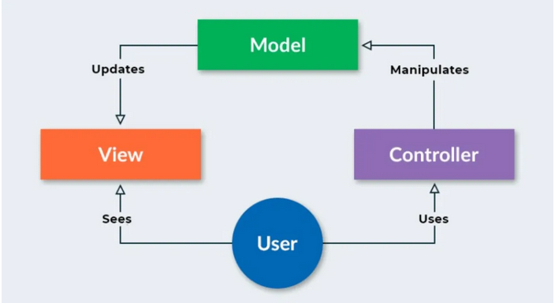

# Laporan Modul 1: Perkenalan Laravel
**Mata Kuliah:** Workshop Web Lanjut   
**Nama:** Rausyanul fikri  
**NIM:** 2024573010122  
**Kelas:** TI 2B  

---

## Abstrak 
Laporan ini menjelaskan tahapan persiapan dalam melakukan setup awal project Laravel serta pengaturan direktori untuk menyimpan seluruh tugas dan laporan dengan format README.md. Tujuan dari laporan ini adalah mendokumentasikan proses instalasi, konfigurasi awal, serta penggunaan GitHub sebagai repositori utama. Dengan adanya dokumentasi ini, setiap tahapan pengembangan dapat tercatat dengan rapi, memudahkan kolaborasi, serta menjaga konsistensi dalam pengelolaan kode dan laporan.

---

## 1. Pendahuluan
**1.1 Perknalan tentang laravel**  
Laravel adalah salah satu framework PHP modern yang dikembangkan untuk mempermudah pengembangan aplikasi web. Framework ini pertama kali diperkenalkan oleh Taylor Otwell pada tahun 2011. Tujuan utama Laravel adalah menyediakan struktur kode yang rapi, sintaks yang mudah dipahami, serta berbagai fitur bawaan yang mendukung pembangunan aplikasi web secara cepat dan efisien.

**1.2 Apa itu Laravel**  
Laravel merupakan framework open-source berbasis PHP yang mengikuti prinsip MVC (Model-View-Controller). Framework ini dirancang untuk membantu pengembang membangun aplikasi web yang terstruktur, mudah dikelola, dan aman. Laravel tidak hanya menyediakan fondasi dasar pengembangan, tetapi juga ekosistem lengkap, mulai dari manajemen database, autentikasi, hingga pembuatan RESTful API.  

**1.3 Karakteristik utama**  
Laravel punya beberapa karakteristik utama yang bikin dia menonjol dibanding framework PHP lain. Pertama, dia pakai MVC (Model-View-Controller), jadi kode terstruktur rapi antara logika bisnis, tampilan, dan pengelolaan data. Kedua, Laravel opinionated, artinya ada konvensi dan standar tertentu yang sudah ditentukan, sehingga pengembang bisa mengikuti pola baku dan kode jadi konsisten. Selain itu, ada Eloquent ORM yang memudahkan interaksi database dengan pendekatan objek, Blade templating engine yang membuat tampilan lebih dinamis dan modular, serta Artisan CLI, command-line tool yang mempercepat pekerjaan pengembang seperti membuat model, controller, atau migrasi database. Semua fitur ini membuat Laravel powerful tapi tetap terorganisir.

**1.4 Jenis Aplikasi yang cocok untuk laravel**  
Laravel cocok digunakan untuk aplikasi web yang kompleks dan dinamis, terutama yang membutuhkan manajemen data dan logika bisnis yang rapi. Contohnya: e-commerce, sistem manajemen konten (CMS), platform edukasi online, aplikasi SaaS, atau aplikasi yang memerlukan autentikasi dan role-based access. Laravel juga cocok untuk proyek startup atau enterprise karena skalabilitasnya bagus, ekosistemnya lengkap, dan dukungan komunitas besar mempermudah pengembangan fitur tambahan atau integrasi dengan layanan pihak ketiga.

---

## 2. Komponen Utama Laravel (ringkas)
- Blade (Templating): Sistem template bawaan Laravel yang memungkinkan pembuatan tampilan web lebih efisien dan modular, dengan sintaks sederhana untuk loop, kondisi, dan include.

- Eloquent (ORM): Object-Relational Mapping yang memudahkan interaksi dengan database melalui model PHP, tanpa perlu menulis query SQL secara manual.

- Routing: Sistem Laravel untuk mengatur URL dan menentukan controller atau closure yang menangani permintaan pengguna.

- Controllers: Komponen yang menampung logika aplikasi, memisahkan pengolahan data dari tampilan agar kode lebih terstruktur.

- Migrations & Seeders: Migration memungkinkan versi kontrol untuk struktur database, sementara seeder digunakan untuk mengisi data awal atau dummy secara otomatis.

- Artisan CLI: Command-line interface Laravel yang mempermudah pembuatan model, controller, migrasi, task otomatis, dan berbagai pekerjaan pengembang lainnya.

- Testing (PHPUnit): Fitur untuk menulis dan menjalankan tes otomatis agar aplikasi tetap stabil dan bebas bug saat dikembangkan.

- Middleware: Komponen yang memfilter atau memproses request HTTP sebelum masuk ke controller, misal untuk autentikasi atau logging.

- Events & Listeners: Sistem untuk memicu aksi tertentu saat event terjadi, memungkinkan arsitektur aplikasi lebih modular dan loosely-coupled.

- Queues: Fitur untuk menunda eksekusi task berat agar tidak mengganggu performa aplikasi real-time.

---

## 3. Berikan penjelasan untuk setiap folder dan files yang ada didalam struktur sebuah project laravel.

### 3.1 app/  
Folder ini adalah tempat kode utama aplikasi. Semua logic, model, dan service ada di sini.

**Folder penting:**
- **Console/** : berisi custom Artisan commands.
- **Exceptions/** : mengatur penanganan error dan exception.
- **Http/** : berisi controller, middleware, request validation.
  - **Controllers/** : class untuk menangani request dan response.
  - **Middleware/** : filter sebelum request dijalankan (misal autentikasi).
  - **Requests/** : class untuk validasi form input.
- **Models/** : tempat Eloquent model (representasi tabel database).
- **Providers/** : class untuk service provider (mendaftarkan service app).

### 3.2 bootstrap/ 
Folder ini berisi Bootstrapping Laravel, konfigurasi awal aplikasi.

**Folder penting:**
- **cache/** : menyimpan file cache konfigurasi untuk mempercepat load aplikasi.

### 3.3 config/ 
Pada folder ini semua konfigurasi aplikasi ada di sini (database, mail, cache, dll).

**File penting:**  
- app.php
- database.php
- queue.php
- mail.php

### 3.4 database/  
Folder ini adalah tempat semua hal terkait database.  

**Folder penting:**
- **migrations/** : script untuk membuat atau mengubah tabel.
- **factories/** : template data palsu untuk testing.
- **seeders/** : script untuk mengisi data awal ke database.

### 3.5 public/
Folder untuk root publik web, semua file yang bisa diakses user.

**File penting:**
- index.php : entry point Laravel.
- favicon.ico, robots.txt
- Folder css/, js/, images/ : asset front-end.

### 3.6 resources/
pada folder ini file yang digunakan untuk frontend & view.

**Folder penting:**
- **views/** : file Blade (templating HTML).
- **lang/** : file untuk i18n (bahasa aplikasi).
- **css/, js/, sass/** : asset mentah sebelum di-compile.

### 3.7 routes/
**Deskripsi:** Semua route web aplikasi didefinisikan di sini.

**File penting:**
- web.php : route untuk aplikasi web.
- api.php : route untuk API.
- console.php : route untuk command-line (Artisan).
- channels.php : konfigurasi broadcast channels.

### 3.8 storage/
Folder untuk menyimpan file yang di-generate aplikasi, log, cache.

**Folder penting:**
- **app/** : file upload user.
- **framework/** : cache, session, view compiled.
- **logs/** : file log aplikasi.

### 3.9 tests/
Folder ini untuk semua unit test dan feature test ada di sini.

**Folder penting:**
- **Feature/** : test fitur aplikasi.
- **Unit/** : test fungsi atau class tertentu.

### 3.10 vendor/
Folder ini gunanya untuk semua library pihak ketiga yang diinstall lewat Composer.

### 3.11 File penting di root
- .env : konfigurasi environment (database, app key, debug, dll)
- artisan : command-line tool Laravel
- composer.json : daftar dependency PHP
- package.json : daftar dependency front-end (npm/yarn)
- webpack.mix.js : konfigurasi mix (compile asset)
- README.md : dokumentasi project

---

## 4. Diagram MVC dan Cara kerjanya

MVC(Model View Controller) adalah sebuah arsitektur perangkat lunak yang memisahkan aplikasi menjadi tiga komponen utama untuk mempermudah pengelolaan dan pengembangan. Model bertanggung jawab terhadap data dan logika bisnis aplikasi, termasuk pengambilan, penyimpanan, dan pemrosesan informasi. View berfungsi untuk menampilkan informasi kepada pengguna, seperti antarmuka atau tampilan yang dilihat di browser. Sementara itu, Controller bertindak sebagai penghubung antara Model dan View, menerima input atau permintaan dari pengguna, memprosesnya melalui Model, dan kemudian menampilkan hasilnya melalui View. Dengan pemisahan ini, aplikasi menjadi lebih terstruktur, mudah dipelihara, dan skalabel.

sumber gambar(https://ids.ac.id/mvc-model-view-controller/)

---

## 6. Kelebihan & Kekurangan (Refleksi Singkat)

### Kelebihan Laravel
- **Struktur Teratur:** Laravel punya struktur folder yang jelas sehingga memudahkan pengembangan dan pemeliharaan aplikasi.  
- **Eloquent ORM:** Mempermudah interaksi dengan database menggunakan sintaks yang lebih mudah dibaca.  
- **Routing & Middleware:** Pengaturan rute dan proteksi akses lebih fleksibel.  
- **Community & Dokumentasi:** Dukungan komunitas besar dan dokumentasi lengkap membuat belajar lebih mudah.  
- **Fitur Lengkap:** Ada sistem autentikasi, validasi, queue, task scheduling, dan banyak lagi yang siap pakai.

### Hal yang Menjadi Tantangan bagi Pemula
- **Kurva Belajar:** Banyak konsep seperti MVC, ORM, dan Service Container yang perlu dipahami.  
- **Konfigurasi Awal:** Setup environment (PHP, Composer, database) bisa membingungkan untuk pemula.  
- **Error Handling:** Pesan error kadang membingungkan jika belum terbiasa debugging di Laravel.  
- **Overhead:** Laravel cukup “berat” untuk aplikasi sederhana karena banyak fitur bawaan.  

---

## 7. Referensi

- **Modul 1 - Introduction** — HackMD  
  https://hackmd.io/@mohdrzu/By0Wc1Dule

- **Model-View-Controller (MVC) — GeeksforGeeks**  
  https://www.geeksforgeeks.org/software-engineering/mvc-framework-introduction/

- **MVC Design Pattern — GeeksforGeeks**  
  https://www.geeksforgeeks.org/system-design/mvc-design-pattern/

- **MVC Architecture Explained: Model, View, Controller — Codecademy**  
  https://www.codecademy.com/article/mvc-architecture-model-view-controller

---
