# Laporan Modul 2: Laravel Fundamentasl
**Mata Kuliah:** Workshop Web Lanjut   
**Nama:** Rausyanuk Fikri   
**NIM:** 2024573010122  
**Kelas:** TI 2B  

---

## Abstrak 
Laporan ini membahas dasar penggunaan framework Laravel dengan fokus pada konsep MVC (Model-View-Controller), routing, middleware, dan Blade templating engine. Praktikum dilakukan untuk memahami cara Laravel menangani request dan response, serta mengimplementasikan aplikasi sederhana berupa halaman kalkulator.

---

## 1. Dasar Teori
### a. Apa itu MVC (Model, View, Controller) 
MVC (Model-View-Controller) adalah pola arsitektur dalam pemrograman aplikasi, termasuk Laravel. Fungsinya supaya kode lebih rapi, terstruktur, dan mudah dikembangkan.
- #### Model  
    Bagian yang mengatur data dan logika bisnis aplikasi.
    Biasanya berhubungan dengan database (misalnya mengambil data pengguna, menyimpan produk baru).
- ####  View
    Bagian yang menampilkan data ke pengguna dalam bentuk tampilan (UI).
    Tidak boleh ada logika bisnis yang rumit di sini, hanya sebatas menampilkan data yang sudah diproses oleh controller.
- #### Controller
  Bagian yang menjadi jembatan antara Model dan View.Menerima request dari pengguna lalu memanggil Model untuk mengambil atau mengolah data dan mengirim data ke View untuk ditampilkan.
  
### b. Konsep Routing di Laravel.
Routing adalah mekanisme pengaturan alur permintaan (request) dari pengguna ke bagian aplikasi yang sesuai. Dalam framework Laravel, routing berfungsi untuk menentukan URL tertentu harus diarahkan ke logika apa bisa langsung ke sebuah closure function atau ke method di dalam controller.

### c. Fungsi Middleware.
Middleware di Laravel adalah lapisan perantara (layer) yang menghubungkan request dari user sebelum sampai ke controller, dan juga bisa memproses response sebelum dikirim kembali ke user. Secara teori, middleware berfungsi sebagai penyaring (filter) untuk setiap request HTTP yang masuk ke aplikasi.

### d. Bagaimana cara Laravel menangani Request dan Response.
Laravel menangani request dan response melalui alur HTTP Lifecycle yang dimulai ketika user mengakses aplikasi lewat browser. Request pertama kali masuk ke public/index.php, lalu diteruskan ke HTTP Kernel yang menjalankan middleware sebagai filter (seperti autentikasi atau proteksi CSRF). Setelah itu, Laravel mencocokkan URL dengan routing yang sudah didefinisikan di routes/web.php, kemudian mengarahkan request ke controller atau fungsi terkait. Controller memproses logika aplikasi, mengambil data dari model bila diperlukan, lalu mengirimkan hasil ke view menggunakan Blade atau langsung mengembalikan response (HTML, JSON, dll). Akhirnya, response dikirim kembali ke browser sehingga dapat ditampilkan kepada pengguna.

### e. Peran Controller dan View.
Controller bertugas sebagai penghubung antara request dari user dengan logika aplikasi. Ia menerima input dari routing, memproses logika atau memanggil Model untuk mengambil data dari database, lalu meneruskan data tersebut ke View. Sedangkan View berfungsi menampilkan data dalam bentuk tampilan antarmuka (UI) menggunakan Blade templating engine. Dengan pemisahan ini, logika aplikasi tetap berada di Controller, sedangkan tampilan dikelola di View, sehingga kode lebih terstruktur, mudah dipelihara, dan rapi.

### f. Fungsi Blade Templating Engine. 
Blade adalah templating engine bawaan Laravel yang berfungsi untuk mempermudah pembuatan tampilan (view) dengan sintaks yang sederhana dan rapi. Dengan Blade, pengembang dapat menggunakan template inheritance (pewarisan template) melalui @extends dan @section, sehingga kode tampilan lebih terorganisir dan tidak berulang-ulang. Blade juga menyediakan directive khusus seperti @if, @foreach, dan @csrf yang memudahkan integrasi logika sederhana ke dalam view tanpa mencampurkan logika kompleks. Selain itu, Blade mendukung fitur komponen dan layout, sehingga antarmuka aplikasi lebih konsisten dan mudah dipelihara. Intinya, fungsi utama Blade adalah untuk menghubungkan data dari Controller agar bisa ditampilkan secara dinamis ke pengguna dengan cara yang efisien, bersih, dan fleksibel.

---

## 2. Langkah-Langkah Praktikum

### 2.1 Praktikum 1 – Route, Controller, dan Blade View

- #### Tambahkan route pada routes/web.php.
  
  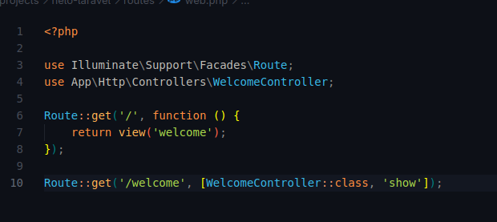

  Route ini untuk memanggil method show() yang ada pada controller welcome controller

- #### Buat controller WelcomeController.  
  
  Pada terminal dan ketik perintah "php artisan make:controller WelcomeController".dan berikut isi dari file welcome controller.

  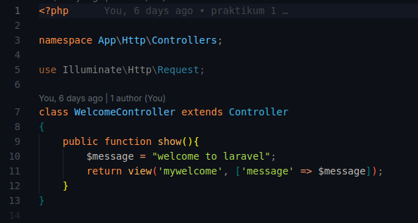
  

- #### Buat view mywelcome.blade.php.
  Buat file mywelcome.blade.php dan berikut isi dari file tersebut.

    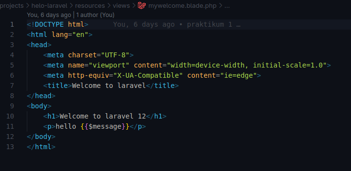
  
- #### Jalankan aplikasi dan tunjukkan hasil di browser.
  Selanjutnya, jalankan aplikasi dengan perintah php artisan serve, maka server Laravel akan berjalan pada alamat http://127.0.0.1:8000  dan arahkan ke route welcome.

    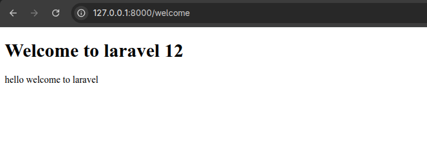

### 2.2 Praktikum 2 – Membuat Aplikasi Sederhana "Calculator"

- #### Tambahkan route untuk kalkulator.
  
    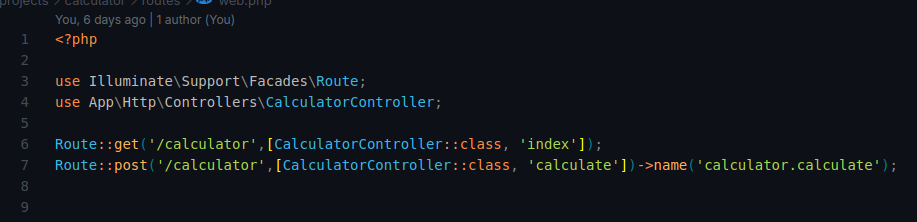

  pada baris ke 5 itu untuk memanggil method index() yang ada pada controller CalculatorController yang akan di buat pada tahap selanjutnya.
  dan pada baris ke 6 itu untuk mengerim data yang di kirim dari form ke method calculate

- #### Buat controller CalculatorController.
    Pada terminal dan ketik perintah "php artisan make:controller CalculateController". dan berikut isi file tersebut.

    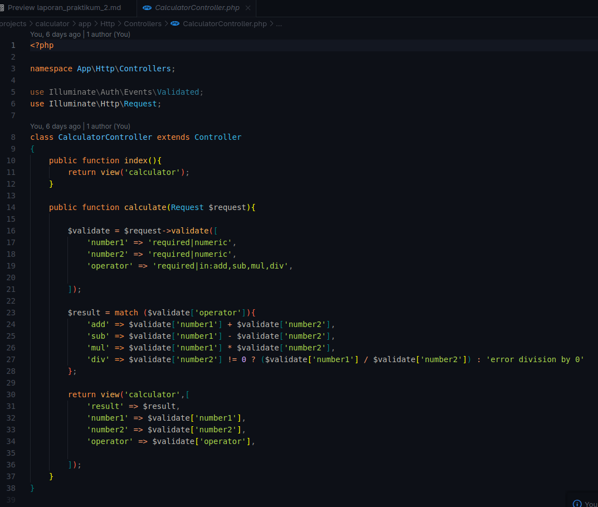

- #### Tambahkan view calculator.blade.php.
  buat file calculator.blade.php pada resources/view, berikut isi dari file tersebut.

    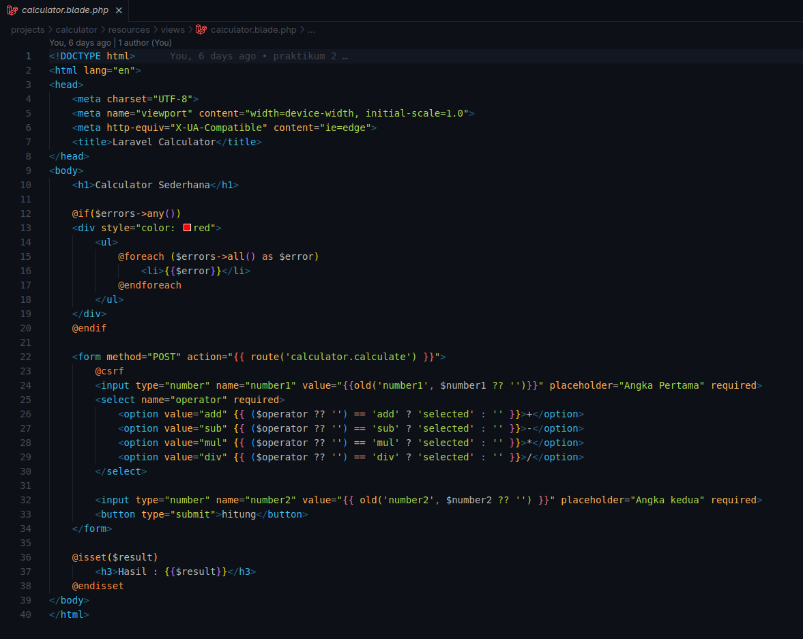

  Pada aplikasi ini, form yang diisi oleh pengguna di view akan dikirim ke CalculatorController melalui method calculate. Pertama, data dari form akan divalidasi terlebih dahulu untuk memastikan input berupa angka agar tidak terjadi kesalahan. Selanjutnya, data diproses sesuai operator yang dipilih:
  - jika operator add, maka dilakukan penjumlahan antara number1 dan number2
  - jika operator sub, maka dilakukan pengurangan
  - jika operator mul, maka dilakukan perkalian
  - Jika operator div, maka sebelum pembagian dilakukan akan dicek terlebih dahulu bahwa number2 tidak bernilai 0, karena pembagian dengan nol tidak valid. 
  
Setelah proses selesai, hasil perhitungan disimpan dalam variabel, lalu dikirim kembali ke view untuk ditampilkan kepada pengguna. berikut tampilan dari aplikasi calculator.
  
Screenshot Hasil operasi penjumlahan:

  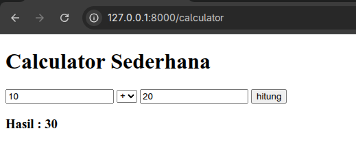

Screenshot Hasil operasi pengurangan:

  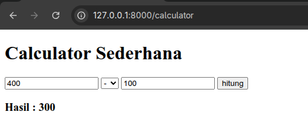

Screenshot Hasil operasi perkalian:

  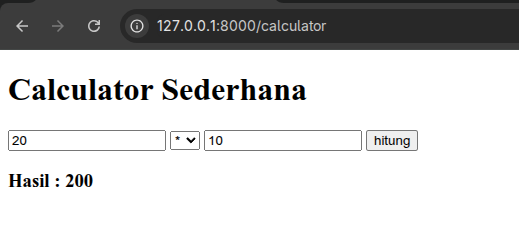

Screenshot Hasil operasi pembagian:

- pembagian dengan 0 akan menampilkan pesan error
  
  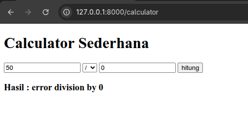

- pembagian
  
  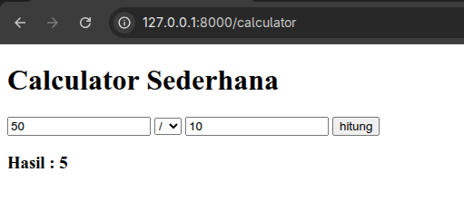
  
  
  

---

## 3. Hasil dan Pembahasan
- Apakah aplikasi berjalan sesuai harapan?  
  aplikasi kalkulator sederhana ini berjalan sesuai harapan. User dapat memasukkan angka dan memilih operator aritmatika (penjumlahan, pengurangan, perkalian, pembagian), lalu hasil perhitungan ditampilkan dengan benar di halaman hasil.

- Apa yang terjadi jika ada input yang salah (misalnya pembagian dengan 0)?    
 Jika terjadi kesalahan input, misalnya user mencoba melakukan pembagian dengan angka 0, maka aplikasi akan menampilkan pesan error " Error division by 0 ". Hal ini dikarenakan operasi pembagian tidak bisa dengan 0.

- Bagaimana validasi input bekerja di Laravel?  
  Laravel menyediakan fitur validasi bawaan untuk memastikan data yang dikirim dari form sesuai aturan yang ditentukan. Dalam kasus ini, input divalidasi agar hanya menerima nilai numerik. Selain itu, ada aturan tambahan khusus untuk operator pembagian, yaitu memastikan angka kedua (number2) tidak sama dengan 0.

- Apa peran masing-masing komponen (Route, Controller, View) dalam program yang dibuat?
  - Route: Berfungsi sebagai penghubung antara URL dengan controller. Route menentukan ke mana request dari user akan diarahkan.

  - Controller: Berisi logika utama dari aplikasi. Pada program ini, controller berperan sebagai tempat logika perhitungan kalkulator, termasuk validasi input, proses aritmatika, dan mengirimkan hasil ke view.

  - View: Menyajikan antarmuka kepada user. View menampilkan form input, hasil perhitungan, maupun pesan error jika ada kesalahan input.

---

## 4. Kesimpulan

Dari percobaan yang sudah dilakukan, aplikasi kalkulator ini bisa berjalan sesuai yang diharapkan. Input dari user bisa diproses dengan baik, dan kalau ada kesalahan input misalnya pembagian sama 0, sistem bisa menampilkan error biar nggak crash. Proses validasi di Laravel juga membantu supaya data yang masuk sesuai aturan. Jadi route ngarahin request, controller ngurus logika hitung, dan view buat nampilin hasil ke user.

---

## 5. Referensi
Apa Itu MVC? Pahami Konsepnya” — Dicoding. https://www.dicoding.com/blog/apa-itu-mvc-pahami-konsepnya/

Blade Bagian 1: Berkenalan dengan Template Engine” — id-Laravel. https://id-laravel.com/post/blade-bagian-1-berkenalan-dengan-template-engine/

B1zwKEK5xe” — HackMD oleh Mohd Rzu. https://hackmd.io/@mohdrzu/B1zwKEK5xe

---
