# **Laporan Modul 4: Laravel Blade Template Engine**  
**Mata Kuliah:** Workshop Web Lanjut  
**Nama:** Rausyanul Fikri  
**NIM:** 2024573010122  
**Kelas:** TI 2B  

---

## **Abstrak**

Laporan ini membahas implementasi *Blade Template Engine* pada framework **Laravel 12**, yang berfungsi sebagai mesin templating untuk mengelola tampilan (*view*) aplikasi web dengan efisien.  
Melalui empat praktikum, mahasiswa mempelajari cara meneruskan data dari *controller* ke *view*, menggunakan struktur kontrol Blade, mengimplementasikan layout dengan Bootstrap, serta membangun sistem tampilan dinamis menggunakan *partial views*, *Blade components*, dan *theme switching*.  

Hasil dari praktikum ini menunjukkan bahwa Blade tidak hanya mempermudah proses pengembangan antarmuka pengguna, tetapi juga membantu menjaga struktur kode agar tetap bersih, modular, dan mudah dipelihara.

---
# **BAB I – Dasar Teori**

## **1.1 Pengertian Blade Template Engine**

**Blade** adalah mesin *templating* bawaan dari *framework* Laravel yang berfungsi untuk memisahkan logika tampilan (*view logic*) dari logika aplikasi (*business logic*).
Dengan Blade, pengembang dapat menulis kode HTML yang disisipi sintaks PHP secara lebih ringkas, bersih, dan mudah dibaca.

### **Fitur Utama Blade**

* Ringan dan cepat
* Mendukung *inheritance* dan *components*
* Menyertakan struktur kontrol seperti `@if`, `@foreach`, `@include`, dan lain-lain

---

## **1.2 Membuat View Blade Pertama**

Untuk membuat *view* Blade, kita dapat membuat file baru di direktori:

```
resources/views/
```

Contoh file `resources/views/welcome.blade.php`:

```blade
<!DOCTYPE html>
<html>
<head>
    <title>Welcome</title>
</head>
<body>
    <h1>Hello, Laravel!</h1>
</body>
</html>
```

Kemudian, di *controller* atau *route*, kita dapat mengembalikan *view* ini:

```php
Route::get('/welcome', function () {
    return view('welcome');
});
```

Kita juga dapat meneruskan data ke dalam *view* menggunakan fungsi `view()`:

```php
Route::get('/greeting', function () {
    return view('greeting', ['name' => 'Agus']);
});
```

Pada file `resources/views/greeting.blade.php`:

```blade
<h1>Hello, {{ $name }}</h1>
```

---

## **1.3 Sintaks dan Direktif Blade**

Blade menyediakan sintaks yang bersih untuk menulis kode PHP di dalam *view*.

### **Menampilkan Data**

```blade
{{ $name }}
{!! $html !!}
```

### **Struktur Kontrol**

Kita dapat menggunakan logika di dalam Blade dengan sintaks seperti:

```blade
@if ($user)
    Hello, {{ $user->name }}
@else
    Welcome, Guest!
@endif
```

### **Perulangan**

```blade
@foreach ($posts as $post)
    <p>{{ $post->title }}</p>
@endforeach
```

---

## **1.4 Layouts dan Sections**

Blade memungkinkan pembuatan *layout* dan *section* untuk mengatur tampilan agar lebih rapi.

Contoh file layout `resources/views/layouts/app.blade.php`:

```blade
<html>
<head>
    <title>My App - @yield('title')</title>
</head>
<body>
    @yield('content')
</body>
</html>
```

Kemudian buat *child view* `resources/views/home.blade.php`:

```blade
@extends('layouts.app')

@section('title', 'Home Page')

@section('content')
    <h1>Welcome to the Home Page</h1>
@endsection
```

---

## **1.5 Blade Components**

*Component* digunakan untuk membuat bagian tampilan yang bisa digunakan kembali.
Kita dapat membuat *component* dengan perintah:

```bash
php artisan make:component Alert
```

Setelah itu, file *view component* dibuat di `resources/views/components/alert.blade.php`:

```blade
<div class="alert alert-danger">
    {{ $slot }}
</div>
```

Penggunaan di dalam *view*:

```blade
<x-alert>
    Something went wrong!
</x-alert>
```

---

## **1.6 Blade Includes**

Kita dapat menyertakan *view* lain ke dalam *view* utama menggunakan `@include`.

Contoh:

```blade
@include('partials.navbar')
```

File `resources/views/partials/navbar.blade.php`:

```blade
<nav>
    <a href="/">Home</a>
    <a href="/about">About</a>
</nav>
```

---

## **1.7 Perulangan dan Kondisional Lanjutan**

Blade juga menyediakan direktif lain seperti:

* `@isset`
* `@empty`
* `@switch`
* `@case`

Contoh penggunaan:

```blade
@switch ($user->role)
    @case('admin')
        <p>Welcome admin</p>
        @break
    @default
        <p>Welcome user</p>
@endswitch
```

---

## **1.8 Menampilkan Error Validasi**

Laravel secara otomatis mengikat pesan error validasi ke variabel `$errors`.
Kita dapat menampilkannya menggunakan:

```blade
@if ($errors->any())
    <div>
        <ul>
            @foreach ($errors->all() as $error)
                <li>{{ $error }}</li>
            @endforeach
        </ul>
    </div>
@endif
```


---

## **BAB II – Hasil dan Pembahasan**

### **2.1 Praktikum 1 – Meneruskan Data dari Controller ke Blade View**

#### **1. Langkah-Langkah**

##### a. Membuat Project Baru

Pembuatan proyek Laravel baru dengan nama modul-4-blade-view menggunakan perintah  
```bash
 laravel new module-4-blade-view
```

##### b. Membuat Controller

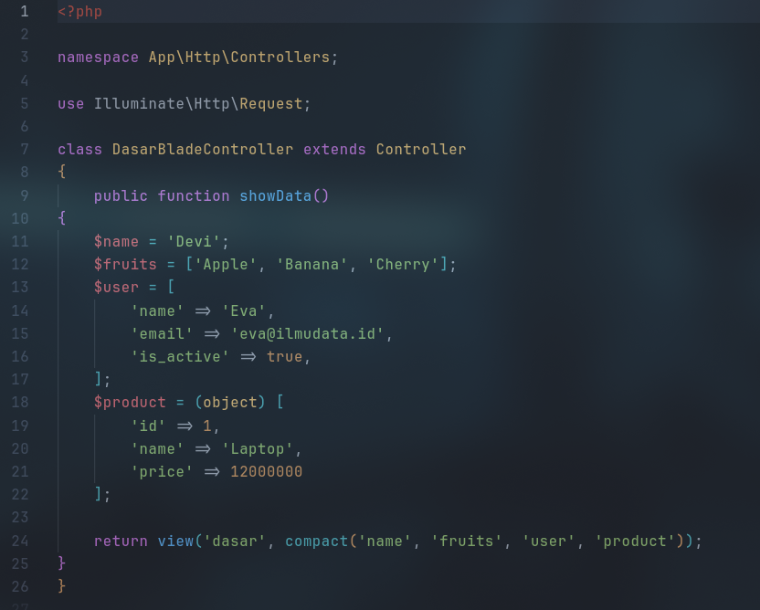  

*Membuat `DasarBladeController` untuk menyiapkan data berupa string, array, associative array, dan object yang akan diteruskan ke view.*

##### c. Menambahkan Route

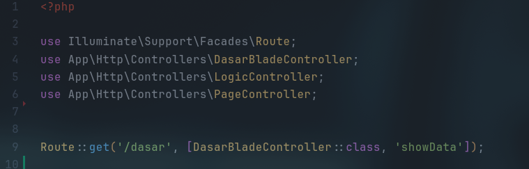 

*Route `/dasar` ditambahkan pada file `web.php` agar dapat diakses dari browser.*

##### d. Membuat View

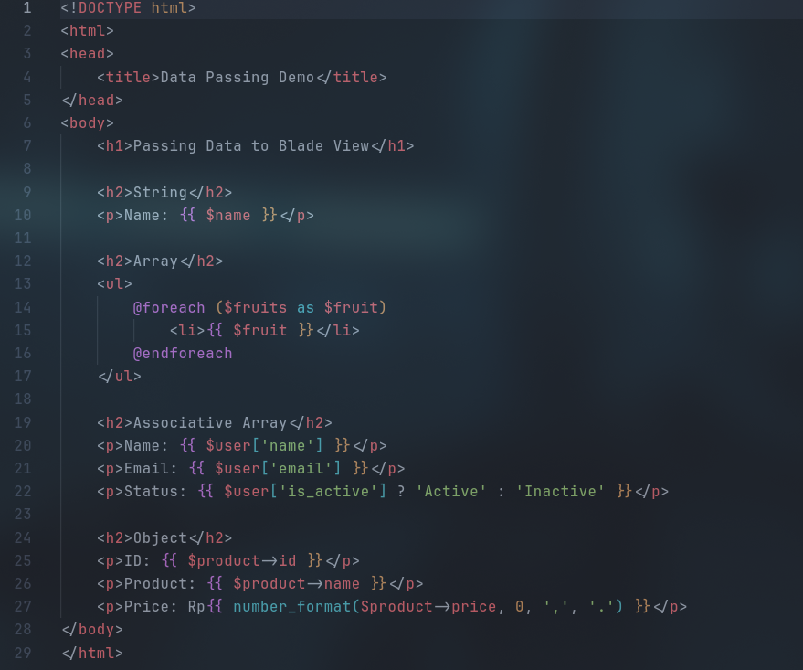

*File `dasar.blade.php` menampilkan data menggunakan sintaks Blade seperti `@foreach` dan ekspresi `{{ $variable }}`.*

##### e. Menjalankan Aplikasi
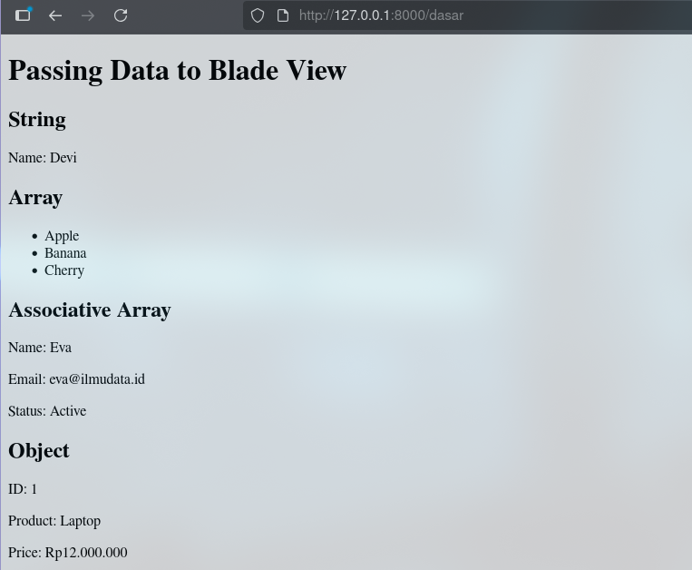
*Tampilan hasil menunjukkan seluruh data telah berhasil diteruskan dan dirender ke dalam view.*

#### **2. Hasil**

Program berhasil menampilkan seluruh data yang dikirimkan dari controller ke view dengan format yang rapi, sesuai dengan tipe data masing-masing.

---

### **2.2 Praktikum 2 – Menggunakan Struktur Kontrol Blade**

#### **1. Langkah-Langkah**

##### a. Membuat Controller

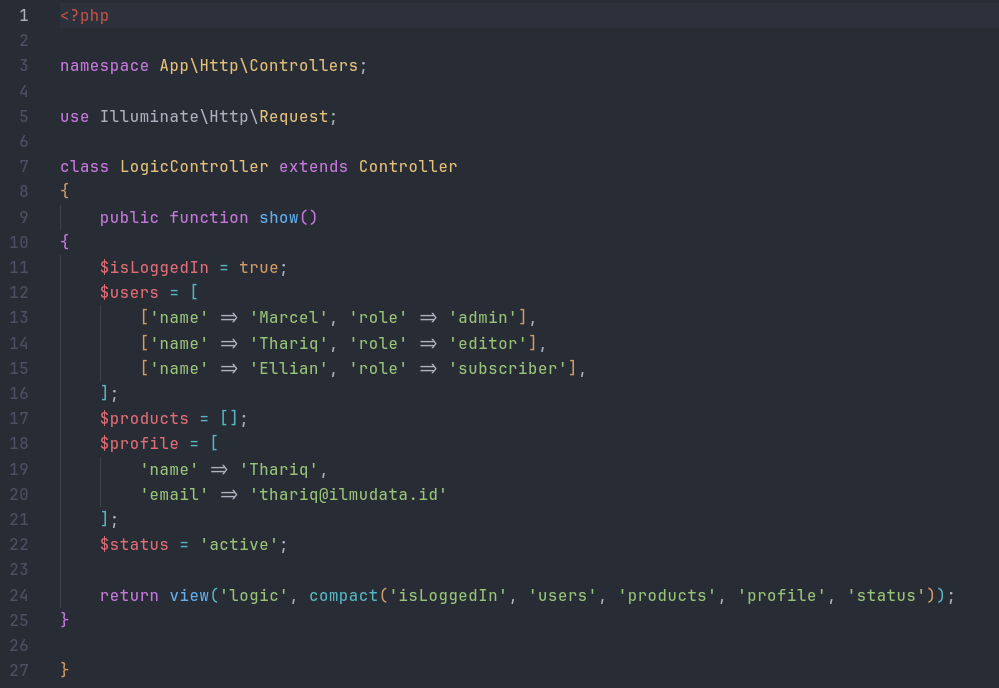

*Membuat `LogicController` yang berisi data pengguna dan kondisi untuk mendemonstrasikan penggunaan struktur kontrol Blade.*

##### b. Menambahkan Route

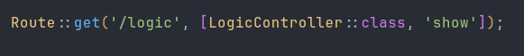
*Menambahkan route `/logic` untuk menampilkan hasil logika di view.*

##### c. Membuat View


```html
<!DOCTYPE html>
<html>
<head>
    <title>Blade Logic Demo</title>
</head>
<body>
    <h1>Blade Control Structures Demo</h1>
    
    <h2>1. @@if / @@else</h2>
    @if ($isLoggedIn)
        <p>Welcome back, user!</p>
    @else
        <p>Please log in.</p>
    @endif
    
    <h2>2. @@foreach</h2>
    <ul>
        @foreach ($users as $user)
            <li>{{ $user['name'] }} - Role: {{ $user['role'] }}</li>
        @endforeach
    </ul>
    
    <h2>3. @@forelse</h2>
    @forelse ($products as $product)
        <p>{{ $product }}</p>
    @empty
        <p>No products found.</p>
    @endforelse
    
    <h2>4. @@isset</h2>
    @isset($profile['email'])
        <p>User Email: {{ $profile['email'] }}</p>
    @endisset
    
    <h2>5. @@empty</h2>
    @empty($profile['phone'])
        <p>No phone number available.</p>
    @endempty
    
    <h2>6. @@switch</h2>
    @switch($status)
        @case('active')
            <p>Status: Active</p>
            @break
        @case('inactive')
            <p>Status: Inactive</p>
            @break
        @default
            <p>Status: Unknown</p>
    @endswitch
</body>
</html>

```
*File `logic.blade.php` berisi implementasi direktif Blade seperti `@if`, `@foreach`, `@isset`, `@empty`, dan `@switch`.*

##### d. Menjalankan Aplikasi

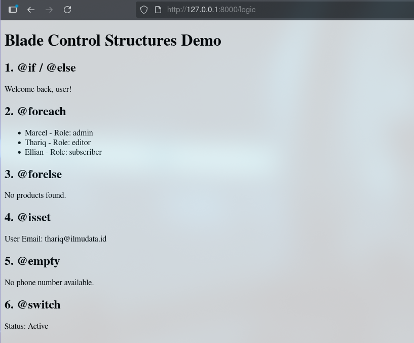
*Menunjukkan hasil penggunaan berbagai struktur kontrol Blade di browser.*

#### **2. Hasil**

Struktur kontrol Blade bekerja dengan baik untuk menangani logika tampilan, seperti kondisi login, daftar pengguna, dan status pengguna.

---

### **2.3 Praktikum 3 – Layout dan Personalisasi di Laravel 12 dengan Bootstrap**

#### **1. Langkah-Langkah**

##### a. Membuat Controller

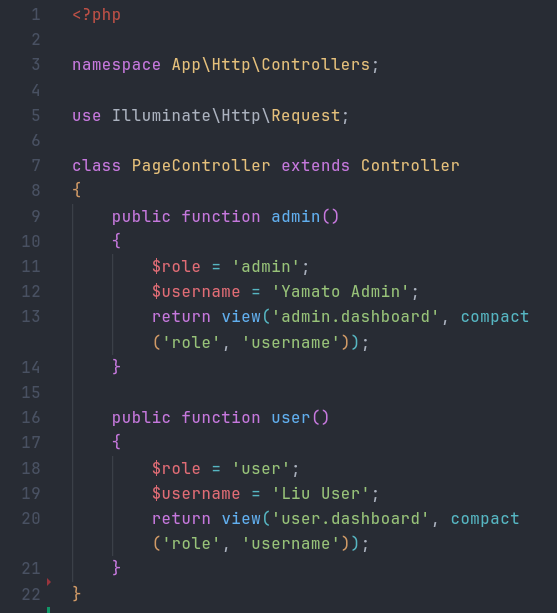  

*Membuat `PageController` yang mengatur tampilan untuk peran admin dan user.*

##### b. Menambahkan Route

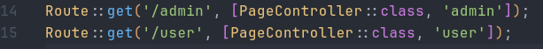      

*Menambahkan route `/admin` dan `/user` untuk menampilkan dua halaman berbeda sesuai peran.*

##### c. Membuat Layout Dasar

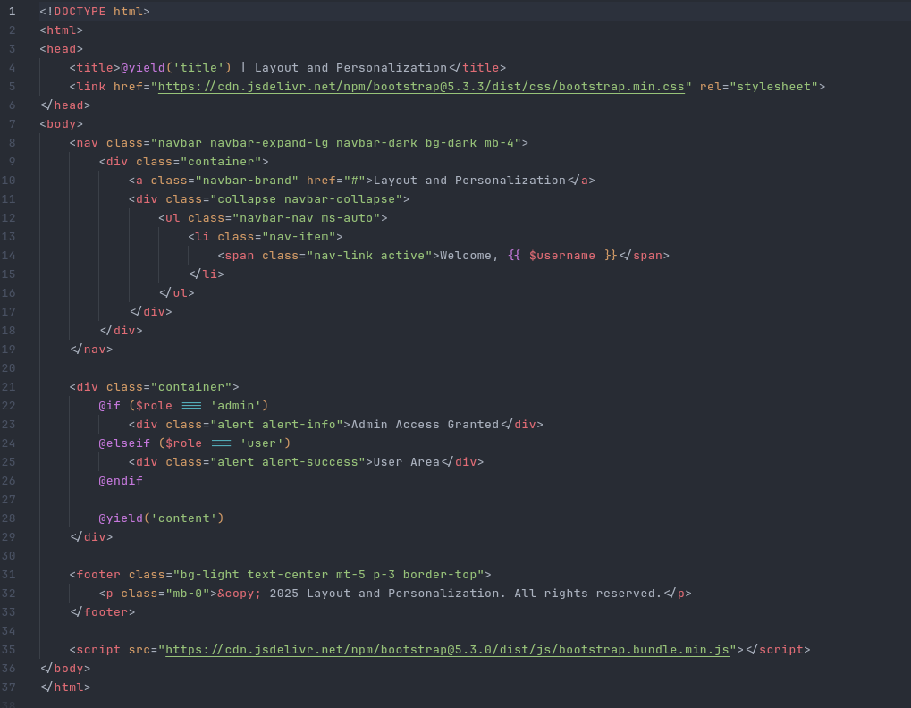    

*File `layouts/app.blade.php` dibuat dengan Bootstrap 5 untuk menampilkan struktur layout yang konsisten di seluruh halaman.*

##### d. Membuat View Admin dan User

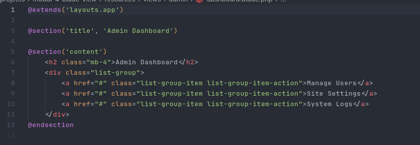  

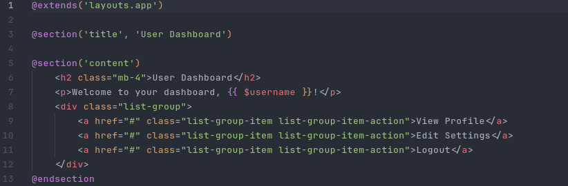  

##### e. Menjalankan Program

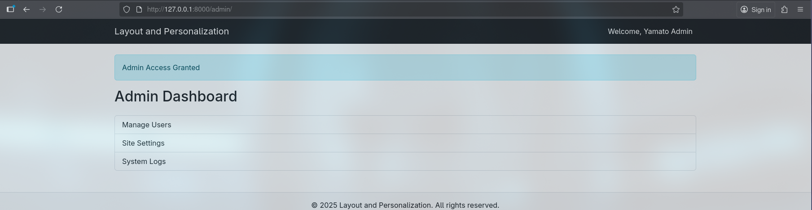  

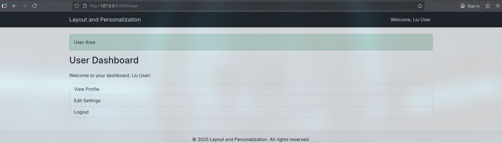      

*Tampilan hasil menunjukkan perbedaan antara halaman admin dan user dengan gaya Bootstrap.*

#### **2. Hasil**

Program berhasil menampilkan layout yang konsisten untuk dua peran berbeda, dengan konten yang dipersonalisasi berdasarkan variabel peran.

---

### **2.4 Praktikum 4 – Partial Views, Blade Components, dan Theme Switching**

#### **1. Langkah-Langkah**
##### a. Membuat Project baru
buat porject baru dengan perintah laravel new

```bash
laravel new modul-4-laravel-ui
```


##### b. Membuat Controller dan Route

- controller

```bash
<?php

namespace App\Http\Controllers;

use Illuminate\Http\Request;

class UIController extends Controller
{
    public function home(Request $request)
    {
        $theme = session('theme', 'light');
        $alertMessage = 'Selamat datang di Laravel UI Integrated Demo!';
        $features = [
            'Partial Views',
            'Blade Components', 
            'Theme Switching',
            'Bootstrap 5',
            'Responsive Design'
        ];
        
        return view('home', compact('theme', 'alertMessage', 'features'));
    }

    public function about(Request $request)
    {
        $theme = session('theme', 'light');
        $alertMessage = 'Halaman ini menggunakan Partial Views!';
        $team = [
            ['name' => 'Ahmad', 'role' => 'Developer'],
            ['name' => 'Sari', 'role' => 'Designer'],
            ['name' => 'Budi', 'role' => 'Project Manager']
        ];
        
        return view('about', compact('theme', 'alertMessage', 'team'));
    }

    public function contact(Request $request)
    {
        $theme = session('theme', 'light');
        $departments = [
            'Technical Support',
            'Sales',
            'Billing',
            'General Inquiry'
        ];
        
        return view('contact', compact('theme', 'departments'));
    }

    public function profile(Request $request)
    {
        $theme = session('theme', 'light');
        $user = [
            'name' => 'John Doe',
            'email' => 'john.doe@example.com',
            'join_date' => '2024-01-15',
            'preferences' => ['Email Notifications', 'Dark Mode', 'Newsletter']
        ];
        
        return view('profile', compact('theme', 'user'));
    }

    public function switchTheme($theme, Request $request)
    {
        if (in_array($theme, ['light', 'dark'])) {
            session(['theme' => $theme]);
        }
        return back();
    }
}

```  

- route
```bash
<?php

use Illuminate\Support\Facades\Route;
use App\Http\Controllers\UIController;

Route::get('/', [UIController::class, 'home'])->name('home');
Route::get('/about', [UIController::class, 'about'])->name('about');
Route::get('/contact', [UIController::class, 'contact'])->name('contact');
Route::get('/profile', [UIController::class, 'profile'])->name('profile');
Route::get('/switch-theme/{theme}', [UIController::class, 'switchTheme'])->name('switch-theme');

```

*Membuat `UIController` untuk menangani seluruh halaman dan sistem penggantian tema (light/dark).*

##### c. Membuat Layout Utama dengan Dukungan Tema

```bash
<!DOCTYPE html>
<html lang="id" data-bs-theme="{{ $theme }}">
<head>
    <meta charset="UTF-8">
    <meta name="viewport" content="width=device-width, initial-scale=1.0">
    <title>@yield('title', 'Laravel UI Integrated Demo')</title>
    <link href="https://cdn.jsdelivr.net/npm/bootstrap@5.3.3/dist/css/bootstrap.min.css" rel="stylesheet">
    <style>
        body {
            padding-top: 4rem;
            transition: all 0.3s ease;
            min-height: 100vh;
        }
        .theme-demo {
            border-radius: 10px;
            padding: 20px;
            margin: 10px 0;
            transition: all 0.3s ease;
        }
        .feature-card {
            transition: transform 0.2s ease;
        }
        .feature-card:hover {
            transform: translateY(-5px);
        }
    </style>
</head>
<body class="{{ $theme === 'dark' ? 'bg-dark text-light' : 'bg-light text-dark' }}">

    <!-- Navigation menggunakan Partial View -->
    @include('partials.navigation')

    <div class="container mt-4">

        <!-- Alert menggunakan Partial View -->
        @if(isset($alertMessage) && !empty($alertMessage))
            @include('partials.alert', ['message' => $alertMessage, 'type' => 'info'])
        @endif

        @yield('content')
    </div>


    <!-- Footer menggunakan Blade Component -->
    <x-footer :theme="$theme" />

    <script src="https://cdn.jsdelivr.net/npm/bootstrap@5.3.3/dist/js/bootstrap.bundle.min.js"></script>
    <script>
        // Smooth theme transition
        document.addEventListener('DOMContentLoaded', function() {
            const themeLinks = document.querySelectorAll('a[href*="switch-theme"]');
            themeLinks.forEach(link => {
                link.addEventListener('click', function(e) {
                    e.preventDefault();
                    window.location.href = this.href;
                });
            });
        });
    </script>
</body>
</html>

```
*Layout utama mendukung dua tema dan menggunakan Bootstrap untuk tampilan responsif.*

##### d. Membuat Partial Views

- alert
```bash
@if(!empty($message))
<div class="alert alert-{{ $type ?? 'info' }} alert-dismissible fade show" role="alert">
    {{ $message }}
    <button type="button" class="btn-close" data-bs-dismiss="alert"></button>
</div>
@endif
```

- navigation
```bash
<nav class="navbar navbar-expand-lg {{ $theme === 'dark' ? 'navbar-dark bg-dark' : 'navbar-light bg-light' }} fixed-top shadow">
    <div class="container">
        <a class="navbar-brand fw-bold" href="{{ route('home') }}">
            Laravel UI Demo
        </a>
        
        <button class="navbar-toggler" type="button" data-bs-toggle="collapse" data-bs-target="#navbarNav">
            <span class="navbar-toggler-icon"></span>
        </button>
        
        <div class="collapse navbar-collapse" id="navbarNav">
            <ul class="navbar-nav me-auto">
                <li class="nav-item">
                    <a class="nav-link {{ request()->routeIs('home') ? 'active' : '' }}" href="{{ route('home') }}">Home</a>
                </li>
                <li class="nav-item">
                    <a class="nav-link {{ request()->routeIs('about') ? 'active' : '' }}" href="{{ route('about') }}">About</a>
                </li>
                <li class="nav-item">
                    <a class="nav-link {{ request()->routeIs('contact') ? 'active' : '' }}" href="{{ route('contact') }}">Contact</a>
                </li>
                <li class="nav-item">
                    <a class="nav-link {{ request()->routeIs('profile') ? 'active' : '' }}" href="{{ route('profile') }}">Profile</a>
                </li>
            </ul>
            
            <ul class="navbar-nav">
                <li class="nav-item dropdown">
                    <a class="nav-link dropdown-toggle" href="#" role="button" data-bs-toggle="dropdown">
                        Theme: {{ ucfirst($theme) }}
                    </a>
                    <ul class="dropdown-menu">
                        <li><a class="dropdown-item" href="{{ route('switch-theme', 'light') }}">Light Mode</a></li>
                        <li><a class="dropdown-item" href="{{ route('switch-theme', 'dark') }}">Dark Mode</a></li>
                    </ul>
                </li>
            </ul>
        </div>
    </div>
</nav>
```

- team-stats
```bash
<div class="card {{ $theme === 'dark' ? 'bg-dark border-light' : '' }} mt-4">
    <div class="card-header">
        <h5>Statistik Tim</h5>
    </div>
    <div class="card-body">
        <div class="row text-center">
            <div class="col-md-3">
                <h3>3</h3>
                <p class="text-muted">Anggota</p>
            </div>
            <div class="col-md-3">
                <h3>12+</h3>
                <p class="text-muted">Proyek</p>
            </div>
            <div class="col-md-3">
                <h3>95%</h3>
                <p class="text-muted">Kepuasan</p>
            </div>
            <div class="col-md-3">
                <h3>2+</h3>
                <p class="text-muted">Tahun</p>
            </div>
        </div>
    </div>
</div>

```  

*Partial views digunakan untuk navbar dan alert agar dapat digunakan ulang di seluruh halaman.*

##### e. Membuat Blade Components
berikut beberapa component yang di buat
```bash
php artisan make:component Footer
php artisan make:component FeatureCard
php artisan make:component TeamMember
php artisan make:component ContactForm
```
 - component footer
 ```bash
 <footer class="mt-5 py-4 border-top {{ $theme === 'dark' ? 'border-secondary' : '' }}">
    <div class="container">
        <div class="row">
            <div class="col-md-6">
                <h5>Laravel UI Integrated Demo</h5>
                <p class="mb-0">Demonstrasi Partial Views, Blade Components, dan Theme Switching</p>
            </div>
            <div class="col-md-6 text-md-end">
                <p class="mb-0">
                    <strong>Current Theme:</strong> 
                    <span class="badge {{ $theme === 'dark' ? 'bg-primary' : 'bg-dark' }}">
                        {{ ucfirst($theme) }}
                    </span>
                </p>
                <p class="mb-0">&copy; 2024 Laravel UI Demo. All rights reserved.</p>
            </div>
        </div>
    </div>
</footer>

 ```
 - component feature card
  ```bash
  @props([
  'title',
  'icon',
  'description',
  'badge',
  'theme',
])


<div class="card feature-card h-100 {{ $theme === 'dark' ? 'bg-secondary text-white' : '' }}">
    <div class="card-body">
        <div class="d-flex align-items-center mb-3">
            <span class="fs-2 me-3">{{ $icon ?? '⭐' }}</span>
            <h5 class="card-title mb-0">{{ $title }}</h5>
        </div>
        <p class="card-text">{{ $description }}</p>
        @if(isset($badge))
            <span class="badge {{ $theme === 'dark' ? 'bg-light text-dark' : 'bg-dark' }}">{{ $badge }}</span>
        @endif
    </div>
</div>

 ```
 
 - component team member
  ```bash
  @props(['name', 'role', 'description', 'avatar' => null, 'theme' => 'light'])

<div class="col-md-4 mb-4">
    <div class="card {{ $theme === 'dark' ? 'bg-dark border-light' : '' }} h-100">
        <div class="card-body text-center">
            <div class="mb-3">
                <span class="fs-1">{{ $avatar ?? '👤' }}</span>
            </div>
            <h5 class="card-title">{{ $name }}</h5>
            <p class="card-text text-muted">{{ $role }}</p>
            <p class="card-text">{{ $description }}</p>
        </div>
    </div>
</div>

 ```

 - component contact form
  ```bash
  @props(['departments', 'theme' => 'light'])

<div class="card {{ $theme === 'dark' ? 'bg-dark border-light' : '' }} h-100">
    <div class="card-header">
        <h5>Form Kontak</h5>
    </div>
    <div class="card-body">
        <form>
            <div class="mb-3">
                <label class="form-label">Nama Lengkap</label>
                <input type="text" class="form-control {{ $theme === 'dark' ? 'bg-dark text-light border-light' : '' }}" placeholder="Masukkan nama Anda">
            </div>
            
            <div class="mb-3">
                <label class="form-label">Email</label>
                <input type="email" class="form-control {{ $theme === 'dark' ? 'bg-dark text-light border-light' : '' }}" placeholder="nama@example.com">
            </div>
            
            <div class="mb-3">
                <label class="form-label">Department</label>
                <select class="form-select {{ $theme === 'dark' ? 'bg-dark text-light border-light' : '' }}">
                    <option selected>Pilih department...</option>
                    @foreach($departments as $dept)
                    <option value="{{ $dept }}">{{ $dept }}</option>
                    @endforeach
                </select>
            </div>
            
            <div class="mb-3">
                <label class="form-label">Pesan</label>
                <textarea class="form-control {{ $theme === 'dark' ? 'bg-dark text-light border-light' : '' }}" rows="4" placeholder="Tulis pesan Anda..."></textarea>
            </div>
            
            <button type="submit" class="btn btn-primary">Kirim Pesan</button>
        </form>
    </div>
</div>
 ```


*Beberapa komponen dibuat untuk footer, kartu fitur, tim, dan form kontak, agar tampilan lebih modular.*

##### f. Membuat View Utama
*View utama menampilkan halaman Home, About, Contact, dan Profile yang memanfaatkan layout, partial, dan komponen.*
- home
```bash
@extends('layouts.app')

@section('title', 'Home - Integrated Demo')

@section('content')
<div class="row">
    <div class="col-12">
        <div class="theme-demo {{ $theme === 'dark' ? 'bg-dark border-light' : 'bg-white border' }} mb-5">
            <h1 class="display-4 mb-4">🚀 Laravel UI Integrated Demo</h1>
            <p class="lead">Demonstrasi lengkap Partial Views, Blade Components, dan Theme Switching dalam satu aplikasi terpadu.</p>

            <div class="row mt-5">
                <div class="col-md-4 mb-4">

                    @include('components.feature-card', [
                        'title' => 'Partial Views',
                        'icon' => '📁',
                        'description' => 'Gunakan @@include untuk reusable UI components dengan data sederhana.',
                        'badge' => 'Latihan 13',
                        'theme' => $theme
                    ])

                </div>

                <div class="col-md-4 mb-4">
                    <x-feature-card
                        title="Blade Components"
                        icon="🧩"
                        description="Komponen Blade dengan props dan slots untuk UI yang lebih kompleks."
                        badge="Latihan 14"
                        :theme="$theme"

                    />
                </div>

                <div class="col-md-4 mb-4">
                    <x-feature-card
                        title="Theme Switching"
                        icon="🎨"
                        description="Toggle antara light dan dark mode dengan session persistence."
                        badge="Latihan 15"
                        :theme="$theme"

                    />
                </div>
            </div>
        </div>

        <div class="row">
            <div class="col-md-6">
                <div class="card {{ $theme === 'dark' ? 'bg-dark border-light' : '' }} mb-4">
                    <div class="card-header">
                        <h5>Fitur Utama</h5>
                    </div>
                    <div class="card-body">
                        <ul class="list-group list-group-flush">
                            @foreach($features as $feature)
                            <li class="list-group-item {{ $theme === 'dark' ? 'bg-dark text-light' : '' }}">
                                - {{ $feature }}
                            </li>
                            @endforeach
                        </ul>
                    </div>
                </div>
            </div>
            <div class="col-md-6">
                <div class="card {{ $theme === 'dark' ? 'bg-dark border-light' : '' }}">
                    <div class="card-header">
                        <h5>Teknologi yang Digunakan</h5>
                    </div>
                    <div class="card-body">
                        <div class="d-flex flex-wrap gap-2">
                            <span class="badge bg-primary">Laravel 12</span>
                            <span class="badge bg-success">Blade Templates</span>
                            <span class="badge bg-info">Bootstrap 5</span>
                            <span class="badge bg-warning">PHP 8.4</span>
                            <span class="badge bg-danger">Session Management</span>
                        </div>
                    </div>
                </div>
            </div>
        </div>
    </div>
</div>
@endsection
```

- about
```bash
@extends('layouts.app')

@section('title', 'About - Partial Views Demo')

@section('content')
<div class="row">
    <div class="col-12">
        <div class="theme-demo {{ $theme === 'dark' ? 'bg-dark border-light' : 'bg-white border' }} mb-4">
            <h1 class="mb-4">About - Partial Views</h1>
            <p class="lead">Halaman ini mendemonstrasikan penggunaan <strong>Partial Views</strong> dengan <code>@@include</code> directive.</p>
        </div>

        <h3 class="mb-4">Tim Kami</h3>
        <div class="row">
            @foreach($team as $member)
            <x-team-member 
                :name="$member['name']"
                :role="$member['role']"
                :theme="$theme"
                :avatar="['👨💻','👩🎨','👨💼'][$loop->index]"
                :description="'Bergabung sejak 2024 dan berkontribusi dalam pengembangan.'"
            />
            @endforeach
        </div>

        <!-- Demonstrasi Partial View dengan Data -->
        @include('partials.team-stats', [
            'theme' => $theme
            ])
    </div>
</div>
@endsection
```

- contact
```bash
@extends('layouts.app')

@section('title', 'Contact - Components Demo')

@section('content')
<div class="row">
    <div class="col-12">
        <div class="theme-demo {{ $theme === 'dark' ? 'bg-dark border-light' : 'bg-white border' }} mb-4">
            <h1 class="mb-4">Contact - Blade Components</h1>
            <p class="lead">Halaman ini mendemonstrasikan penggunaan <strong>Blade Components</strong> dengan props dan slots.</p>
        </div>

        <div class="row">
            <div class="col-md-6">
                <x-contact-form :theme="$theme" :departments="$departments" />
            </div>
            <div class="col-md-6">
                <div class="card {{ $theme === 'dark' ? 'bg-dark border-light' : '' }} h-100">
                    <div class="card-header">
                        <h5>Informasi Kontak</h5>
                    </div>
                    <div class="card-body">
                        <p><strong>Email:</strong> info@laraveldemo.com</p>
                        <p><strong>Telepon:</strong> +62 21 1234 5678</p>
                        <p><strong>Alamat:</strong> Jakarta, Indonesia</p>
                        
                        <h6 class="mt-4">Department Tersedia:</h6>
                        <ul>
                            @foreach($departments as $dept)
                            <li>{{ $dept }}</li>
                            @endforeach
                        </ul>
                    </div>
                </div>
            </div>
        </div>
    </div>
</div>
@endsection
```

- profile
```bash
@extends('layouts.app')

@section('title', 'Profile - Theme Demo')

@section('content')
<div class="row">
    <div class="col-12">
        <div class="theme-demo {{ $theme === 'dark' ? 'bg-dark border-light' : 'bg-white border' }} mb-4">
            <h1 class="mb-4">Profile - Theme Demo</h1>
            <p class="lead">Halaman ini menunjukkan implementasi <strong>Theme Switching</strong> dengan session persistence.</p>
        </div>

        <div class="row">
            <div class="col-md-4">
                <div class="card {{ $theme === 'dark' ? 'bg-dark border-light' : '' }} text-center">
                    <div class="card-body">
                        <div class="mb-3">
                            <span class="fs-1">👤</span>
                        </div>
                        <h4>{{ $user['name'] }}</h4>
                        <p class="text-muted">{{ $user['email'] }}</p>
                        <p class="text-muted">Bergabung: {{ date('d M Y', strtotime($user['join_date'])) }}</p>
                    </div>
                </div>
            </div>
            
            <div class="col-md-8">
                <div class="card {{ $theme === 'dark' ? 'bg-dark border-light' : '' }}">
                    <div class="card-header">
                        <h5>Preferensi Pengguna</h5>
                    </div>
                    <div class="card-body">
                        <h6>Theme Saat Ini:</h6>
                        <div class="alert alert-{{ $theme === 'dark' ? 'dark' : 'info' }} d-flex align-items-center">
                            <span class="me-2 fs-4">{{ $theme === 'dark' ? '🌙' : '☀️' }}</span>
                            <div>
                                <strong>Mode {{ ucfirst($theme) }}</strong> - 
                                @if($theme === 'dark')
                                    Nyaman di malam hari dan mengurangi ketegangan mata.
                                @else
                                    Cerah dan jelas, cocok untuk siang hari.
                                @endif
                            </div>
                        </div>
                        
                        <h6 class="mt-4">Preferensi Lainnya:</h6>
                        <div class="d-flex flex-wrap gap-2">
                            @foreach($user['preferences'] as $pref)
                            <span class="badge bg-secondary">{{ $pref }}</span>
                            @endforeach
                        </div>
                        
                        <div class="mt-4">
                            <h6>Ubah Tema:</h6>
                            <div class="btn-group" role="group">
                                <a href="{{ route('switch-theme', 'light') }}" 
                                   class="btn btn-{{ $theme === 'light' ? 'primary' : 'outline-primary' }}">
                                    Light Mode
                                </a>
                                <a href="{{ route('switch-theme', 'dark') }}" 
                                   class="btn btn-{{ $theme === 'dark' ? 'primary' : 'outline-primary' }}">
                                    Dark Mode
                                </a>
                            </div>
                        </div>
                    </div>
                </div>
            </div>
        </div>
    </div>
</div>
@endsection
```


##### g. Menguji Theme Switching


*Menampilkan hasil perubahan tema terang dan gelap dengan penyimpanan preferensi menggunakan session.*

- light theme  

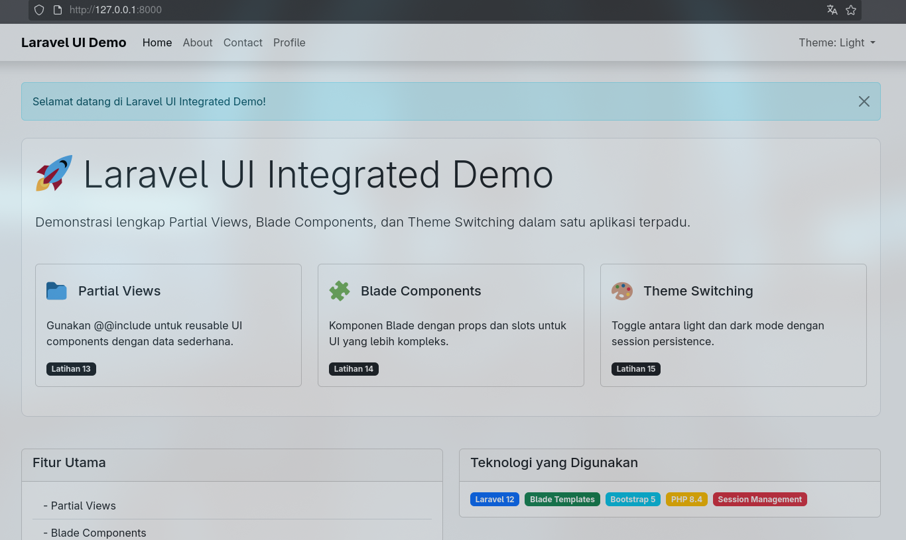  

- dark theme

  


#### Menampilkan semua tampilan halaman
- home

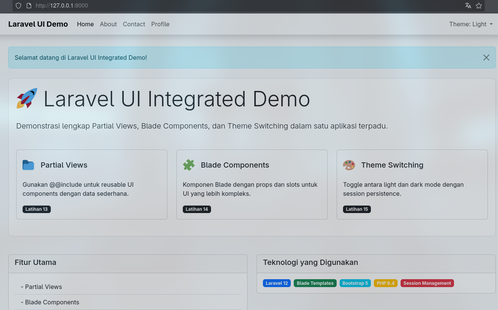  

- about

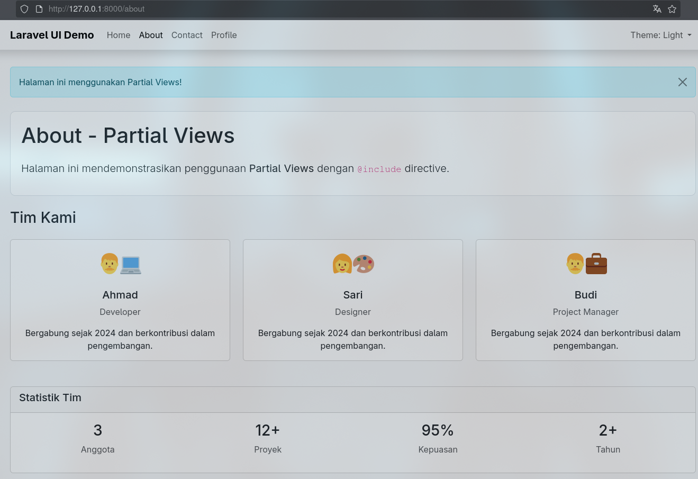  

- contact

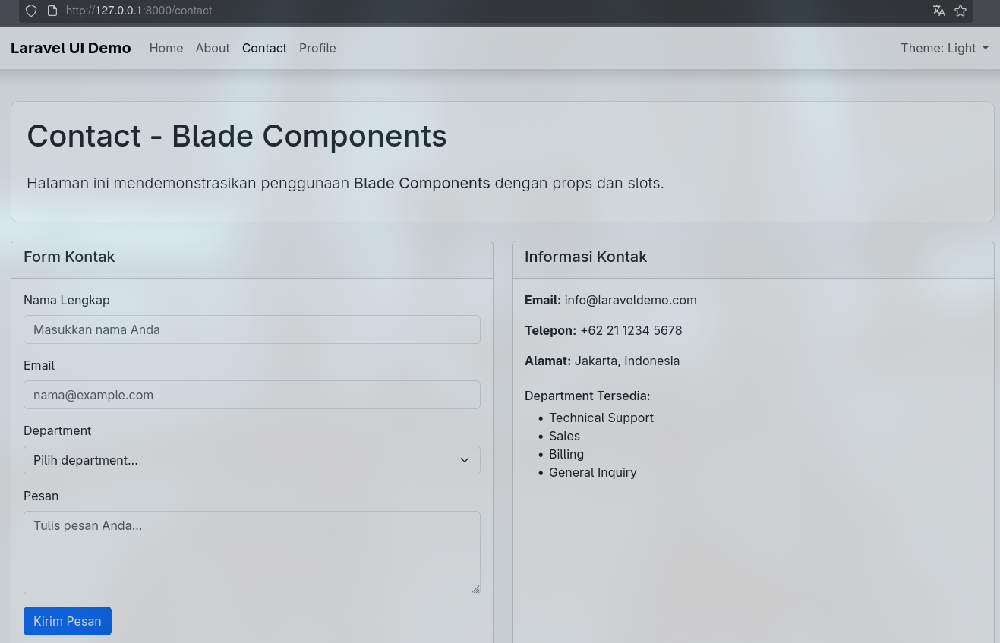  

- profile

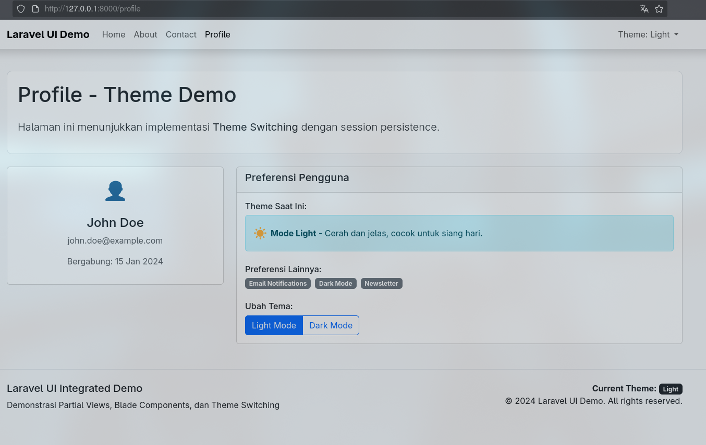  


#### **2. Hasil**

Aplikasi berjalan dengan baik dan menampilkan tampilan dinamis yang dapat diubah tema-nya.
Partial view dan component mempermudah pengelolaan elemen UI, sedangkan session memastikan konsistensi preferensi pengguna.

---

## **BAB III – Kesimpulan**

Dari keempat praktikum yang dilakukan, dapat disimpulkan bahwa **Blade Template Engine** merupakan komponen penting dalam pengembangan aplikasi Laravel modern.
Blade mempermudah pemisahan antara logika dan tampilan, mendukung *layout inheritance*, dan memfasilitasi pembuatan UI yang modular melalui *component* dan *partial view*.

Penerapan konsep seperti *theme switching* juga menunjukkan fleksibilitas Blade dalam mengelola tampilan yang dinamis.
Dengan memahami struktur Blade, pengembang dapat membangun aplikasi yang lebih efisien, rapi, dan mudah dikembangkan ke depannya.

---

## **Daftar Pustaka**

* **Modul 4 – Blade Template Engine** — HackMD
  [https://hackmd.io/@mohdrzu/SyEB73dnxg](https://hackmd.io/@mohdrzu/SyEB73dnxg)

* **Laravel Official Documentation — Blade Templates**
  [https://laravel.com/docs/12.x/blade](https://laravel.com/docs/12.x/blade)

* **Laravel Blade Components — DigitalOcean**
  [https://www.digitalocean.com/community/tutorials/laravel-blade-components](https://www.digitalocean.com/community/tutorials/laravel-blade-components)


