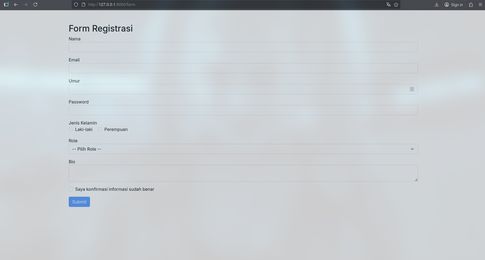
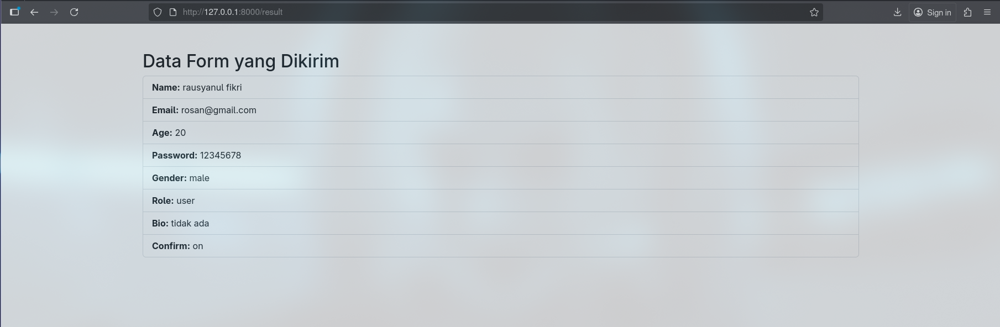
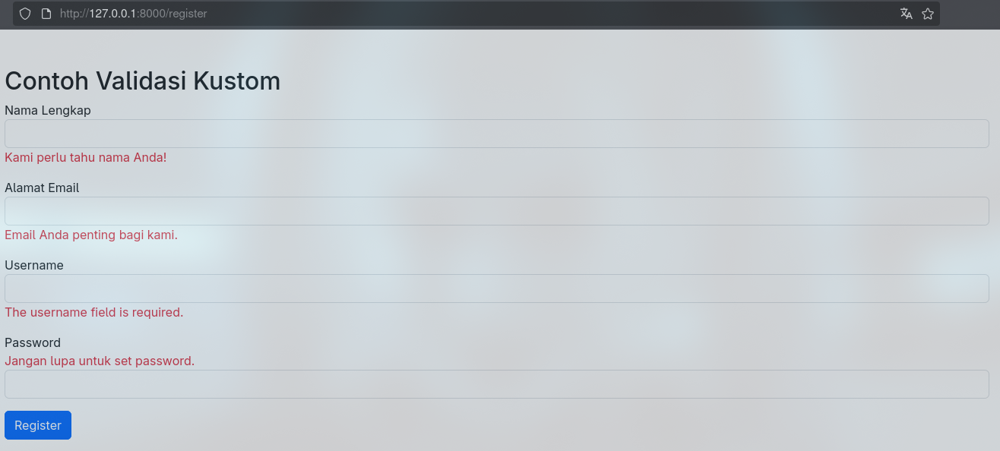
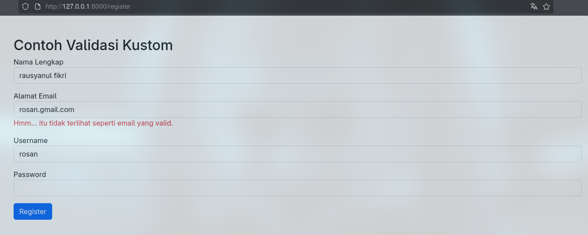
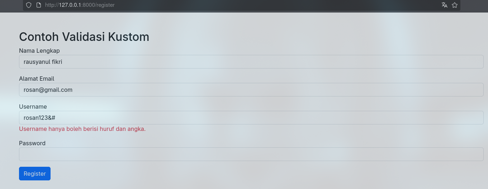
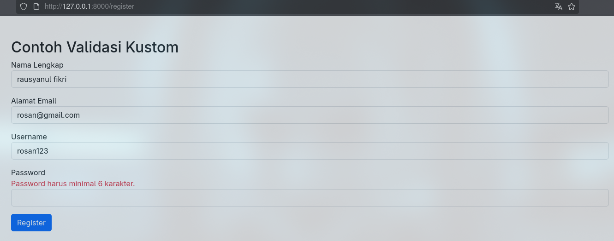
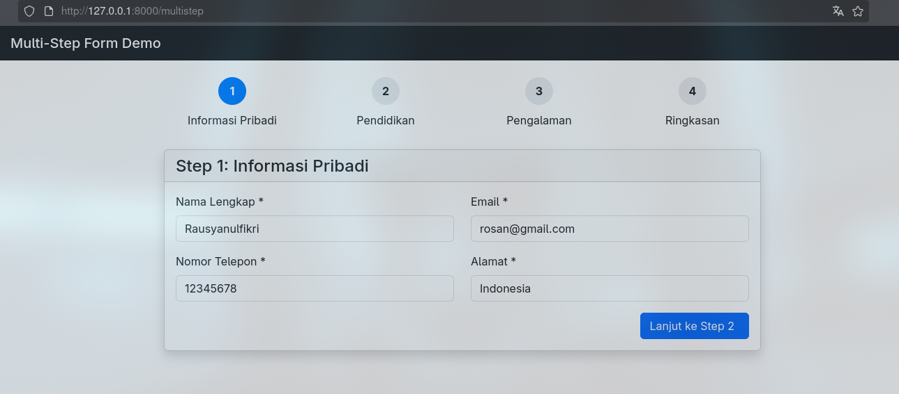
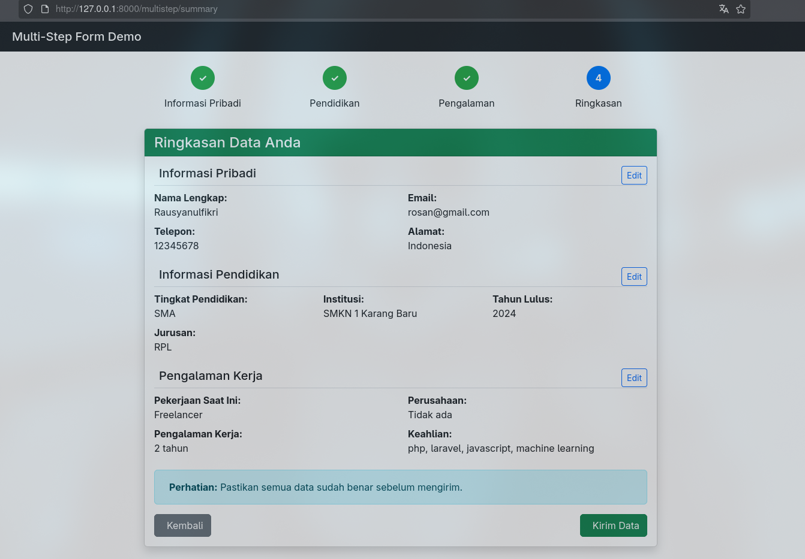
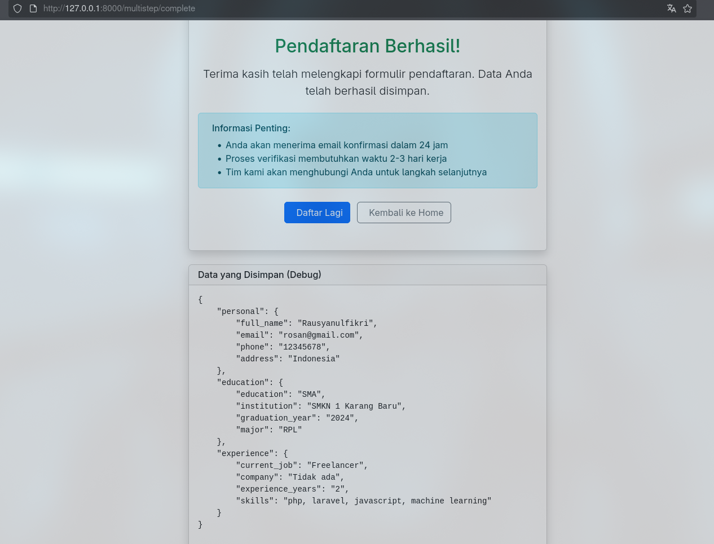

# **Laporan Modul 5: Form Submission & Data Validation**

**Mata Kuliah:** Workshop Web Lanjut  
**Nama:** Rausyanul Fikri  
**NIM:** 2024573010122  
**Kelas:** TI 2B  

---

## **Abstrak**

Laporan ini membahas penerapan **Form Submission dan Data Validation** pada **Laravel 12**, yang berfungsi untuk memastikan keamanan serta keakuratan input pengguna.
Melalui tiga praktikum, mahasiswa mempelajari bagaimana proses pengiriman data dari form ke server diolah menggunakan arsitektur *Request–Response*, bagaimana validasi dijalankan untuk mencegah input tidak sah, serta bagaimana Laravel memfasilitasi pengalaman pengguna melalui *custom validation message* dan *multi-step form*.

Setiap praktikum memberikan pemahaman konkret mengenai manajemen input, validasi, dan pengelolaan data sementara menggunakan session untuk menjaga alur pengisian form yang efisien dan aman.

---

# **BAB I – Dasar Teori**

## **1.1 Konsep Form Submission dalam Laravel**

Laravel memanfaatkan pola **MVC (Model–View–Controller)** dalam menangani form.
Form di-*render* dari **View**, dikirim ke **Controller** melalui **Request**, dan hasilnya dikembalikan ke pengguna melalui **Response**.
Alur singkatnya:

1. Pengguna mengisi form pada halaman view.
2. Browser mengirim request (biasanya POST).
3. Middleware memproses request termasuk pengecekan token CSRF.
4. Controller menerima data, melakukan validasi, dan jika berhasil, meneruskan data ke tahap berikut (penyimpanan/session/halaman hasil).
5. Laravel mengembalikan *response* ke browser.

Proses ini menjaga agar data yang masuk ke aplikasi tetap valid dan aman.

---

## **1.2 Proteksi CSRF**

**Cross-Site Request Forgery (CSRF)** merupakan serangan di mana pengguna secara tidak sadar menjalankan aksi pada aplikasi tempat mereka sudah login.
Laravel memberikan perlindungan otomatis dengan **token CSRF** yang unik di setiap session.

Mekanisme:

* Direktif `@csrf` di dalam form akan menghasilkan input tersembunyi yang berisi token.
* Middleware `VerifyCsrfToken` membandingkan token form dan token session.
* Jika tidak cocok, Laravel menolak request dengan error 419.

Dengan sistem ini, form hanya dapat dikirim melalui sumber yang sah dari aplikasi itu sendiri.

---

## **1.3 Validasi Data**

Validasi data memastikan input yang diterima sesuai aturan bisnis dan format yang diharapkan.
Laravel menyediakan tiga pendekatan utama:

1. **Inline Validation** menggunakan `$request->validate()`.
2. **Form Request Validation** melalui class terpisah di `app/Http/Requests/`.
3. **Manual Validation** memakai `Validator::make()` untuk kontrol penuh.

Validasi ini mencegah kesalahan umum seperti field kosong, format email salah, nilai duplikat di database, maupun potensi *XSS*.

---

## **1.4 Aturan Validasi (Rules)**

Laravel memiliki ratusan aturan validasi yang siap digunakan, di antaranya:

* **Keharusan:** `required`, `nullable`, `filled`, `sometimes`
* **Tipe Data:** `string`, `integer`, `numeric`, `boolean`, `array`, `file`
* **Batas Nilai:** `min`, `max`, `between`, `size`
* **Keterkaitan Database:** `unique`, `exists`
* **Format Data:** `email`, `url`, `date`, `regex`
* **Perbandingan:** `confirmed`, `same`, `different`
* **Kondisional:** `required_if`, `required_with`, `required_without`

Dengan kombinasi tersebut, data yang masuk bisa dikontrol secara ketat.

---

## **1.5 Error Handling dan User Feedback**

Setelah validasi dijalankan, Laravel otomatis mengisi objek `$errors` yang berisi pesan kegagalan.
Pesan dapat ditampilkan:

* Secara **spesifik per field** dengan direktif `@error`.
* Secara **global** menggunakan `$errors->any()` dan `$errors->all()`.
* Dengan **retensi input lama** menggunakan helper `old()`, agar pengguna tidak perlu mengetik ulang.

Pendekatan ini membuat form lebih ramah dan mudah diperbaiki oleh pengguna.

---

## **1.6 Custom Validation dan Pesan Error**

Laravel mendukung pesan error yang dikustomisasi agar lebih komunikatif.
Pesan default dapat diubah di parameter kedua method `validate()`,
atau dengan membuat **Rule Class** sendiri menggunakan `php artisan make:rule`.
Selain itu, closure dapat digunakan untuk validasi sederhana tanpa class terpisah.

---

## **1.7 Multi-Step Form dan Session**

Untuk form yang panjang, Laravel dapat membagi input menjadi beberapa langkah.
Setiap langkah menyimpan data ke session sementara, lalu digabung pada akhir proses.
Pendekatan ini menjaga pengalaman pengguna agar tidak kewalahan dan mencegah kehilangan data jika halaman direfresh.

---

# **BAB II – Hasil dan Pembahasan**

---

## **2.1 Praktikum 1 – Menangani Request dan Response View di Laravel 12**

### **1. Langkah-Langkah**

#### a. Membuat Project Baru

```bash
laravel new form-app
cd form-app
code .
```

Penjelasan:
Perintah di atas membuat proyek Laravel baru bernama **form-app**.
Struktur dasar proyek terbentuk lengkap dengan direktori `app/`, `routes/`, `resources/`, dan lain-lain.

---

#### b. Membuat Controller

```bash
php artisan make:controller FormController
```
Berikut isi dari controller tersebut :
```bash
<?php

namespace App\Http\Controllers;
use Illuminate\Http\Request;

class FormController extends Controller
{
    public function showForm()
    {
        return view('form');
    }

    public function handleForm(Request $request)
    {
        $validated = $request->validate([
            'name' => 'required|string|max:255',
            'email' => 'required|email',
            'age' => 'required|integer|min:1',
            'password' => 'required|min:6',
            'gender' => 'required',
            'role' => 'required',
            'bio' => 'required',
            'confirm' => 'accepted',
        ]);

        return redirect()->route('form.result')->with('data', $validated);
    }

    public function showResult()
    {
        $data = session('data');
        return view('result', compact('data'));
    }
}


```

Penjelasan :
Controller ini akan menampung tiga metode utama:

* `showForm()` untuk menampilkan form,
* `handleForm()` untuk memproses data dan validasi,
* `showResult()` untuk menampilkan hasil input setelah validasi berhasil.

---

#### c. Menambahkan Route

```bash
Route::get('/form', [FormController::class, 'showForm'])->name('form.show');
Route::post('/form', [FormController::class, 'handleForm'])->name('form.handle');
Route::get('/result', [FormController::class, 'showResult'])->name('form.result');
```

Penjelasan:
Route didefinisikan untuk menautkan URL dengan metode di `FormController`, yaitu route GET untuk menampilkan form, POST untuk menangani pengiriman, dan GET tambahan untuk menampilkan hasil.

---

#### d. Membuat View Form

```bash
<!DOCTYPE html>
<html>
<head>
    <title>Pengiriman Form</title>
    <link href="https://cdn.jsdelivr.net/npm/bootstrap@5.3.3/dist/css/bootstrap.min.css" rel="stylesheet">
</head>
<body class="container mt-5">
    <h2>Form Registrasi</h2>
    <form method="POST" action="{{ route('form.handle') }}">
        @csrf
        <div class="mb-3">
            <label>Nama</label>
            <input type="text" name="name" class="form-control" value="{{ old('name') }}">
            @error('name') <div class="text-danger">{{ $message }}</div> @enderror
        </div>
        <div class="mb-3">
            <label>Email</label>
            <input type="email" name="email" class="form-control" value="{{ old('email') }}">
            @error('email') <div class="text-danger">{{ $message }}</div> @enderror
        </div>
        <div class="mb-3">
            <label>Umur</label>
            <input type="number" name="age" class="form-control" value="{{ old('age') }}">
            @error('age') <div class="text-danger">{{ $message }}</div> @enderror
        </div>
        <div class="mb-3">
            <label>Password</label>
            <input type="password" name="password" class="form-control">
            @error('password') <div class="text-danger">{{ $message }}</div> @enderror
        </div>
        <div class="mb-3">
            <label>Jenis Kelamin</label><br>
            <div class="form-check form-check-inline">
                <input class="form-check-input" type="radio" name="gender" value="male"> Laki-laki
            </div>
            <div class="form-check form-check-inline">
                <input class="form-check-input" type="radio" name="gender" value="female"> Perempuan
            </div>
            @error('gender') <div class="text-danger">{{ $message }}</div> @enderror
        </div>
        <div class="mb-3">
            <label>Role</label>
            <select name="role" class="form-select">
                <option value="">-- Pilih Role --</option>
                <option value="user">User</option>
                <option value="admin">Admin</option>
            </select>
            @error('role') <div class="text-danger">{{ $message }}</div> @enderror
        </div>
        <div class="mb-3">
            <label>Bio</label>
            <textarea name="bio" class="form-control">{{ old('bio') }}</textarea>
            @error('bio') <div class="text-danger">{{ $message }}</div> @enderror
        </div>
        <div class="form-check mb-3">
            <input type="checkbox" id="confirm" name="confirm" class="form-check-input">
            <label class="form-check-label" for="confirm">Saya konfirmasi informasi sudah benar</label>
            @error('confirm') <div class="text-danger">{{ $message }}</div> @enderror
        </div>
        <button type="submit" class="btn btn-primary" id="submitBtn" disabled>Submit</button>
    </form>

    <script>
        document.getElementById('confirm').addEventListener('change', function() {
            document.getElementById('submitBtn').disabled = !this.checked;
        });
    </script>
</body>
</html>

```

Penjelasan:
View ini berisi berbagai elemen input HTML—`text`, `email`, `number`, `password`, `radio`, `select`, dan `textarea`—serta direktif `@csrf` untuk keamanan.
Setiap field dilengkapi pengecekan error menggunakan `@error('field')`.

---

#### e. Membuat View Hasil

```bash
<!DOCTYPE html>
<html>
<head>
    <title>Hasil Form</title>
    <link href="https://cdn.jsdelivr.net/npm/bootstrap@5.3.3/dist/css/bootstrap.min.css" rel="stylesheet">
</head>
<body class="container mt-5">
    <h2>Data Form yang Dikirim</h2>
    @if ($data)
        <ul class="list-group">
            @foreach ($data as $key => $value)
                <li class="list-group-item"><strong>{{ ucfirst($key) }}:</strong> {{ $value }}</li>
            @endforeach
        </ul>
    @else
        <p>Tidak ada data tersedia.</p>
    @endif
</body>
</html>

```

Penjelasan:
View hasil menampilkan data yang telah tervalidasi.
Data diambil dari session menggunakan `session('data')`.
Jika validasi gagal, pengguna diarahkan kembali ke form dengan pesan error.

---

#### **2. Hasil**
Berikut tampilan dari hasil program yang telah di buat :

**http://127.0.0.1:8000/form**  



**http://127.0.0.1:8000/result**  




Form berjalan dengan validasi yang sesuai.
Field wajib harus diisi, format email diverifikasi, dan tombol submit hanya aktif setelah pengguna menyetujui checkbox konfirmasi.
Laravel menampilkan pesan error otomatis bila input tidak valid.

---

## **2.2 Praktikum 2 – Validasi Kustom dan Pesan Error**

Untuk membuat validasi kustom dan pesan error dengan menggunakan project pada praktikum satu berikut langkah langkah yang dilakukan :

### **1. Langkah-Langkah**

#### a. Menambahkan Route

Menambahkan route pada route/web.php sebelumnya 

```bash
use App\Http\Controllers\RegisterController;

Route::get('/register', [RegisterController::class, 'showForm'])->name('register.show');
Route::post('/register', [RegisterController::class, 'handleForm'])->name('register.handle');

```

Penjelasan:
Route baru dibuat untuk menampilkan form register dan menangani pengiriman melalui `RegisterController`.

---

#### b. Membuat Controller Baru

```bash
<!DOCTYPE html>
<html>
<head>
    <title>Form Register</title>
    <link href="https://cdn.jsdelivr.net/npm/bootstrap@5.3.3/dist/css/bootstrap.min.css" rel="stylesheet">
</head>
<body class="container mt-5">
    <h2>Contoh Validasi Kustom</h2>

    @if (session('success'))
        <div class="alert alert-success">
            {{ session('success') }}
        </div>
    @endif

    <form method="POST" action="{{ route('register.handle') }}">
        @csrf
        <div class="mb-3">
            <label for="name">Nama Lengkap</label>
            <input name="name" class="form-control" value="{{ old('name') }}">
            @error('name') <div class="text-danger">{{ $message }}</div> @enderror
        </div>
        <div class="mb-3">
            <label for="email">Alamat Email</label>
            <input name="email" class="form-control" value="{{ old('email') }}">
            @error('email') <div class="text-danger">{{ $message }}</div> @enderror
        </div>
        <div class="mb-3">
            <label for="username">Username</label>
            <input name="username" class="form-control" value="{{ old('username') }}">
            @error('username') <div class="text-danger">{{ $message }}</div> @enderror
        </div>
        <div class="mb-3">
            <label for="password">Password</label>
            @error('password') <div class="text-danger">{{ $message }}</div> @enderror
            <input type="password" name="password" class="form-control">
        </div>
        <button type="submit" class="btn btn-primary">Register</button>
    </form>
</body>
</html>

```

Penjelasan:
Form terdiri atas field `name`, `email`, `username`, dan `password`.
Validasi menggunakan kombinasi rule seperti `required`, `email`, `regex`, dan `min`.
Pesan error ditampilkan tepat di bawah field masing-masing.

---

#### **2. Hasil**

Berikut percobaan yang di lakukan pada program :

- **Biarkan field kosong**



- **Masukkan email tidak valid**



- **Ketik non-alphanumeric di username**



- **Gunakan password pendek**




Secara keseluruhan, validasi kustom pada form registrasi berjalan dengan sempurna.
Laravel menampilkan setiap pesan error secara kontekstual di bawah input yang relevan,
tanpa mengganggu data yang telah dimasukkan sebelumnya berkat penggunaan fungsi old().
Pendekatan ini memperkuat user experience dengan menyediakan umpan balik langsung yang informatif dan personal,
serta membuktikan bahwa Laravel’s validation system mampu menangani skenario kompleks dengan mudah.

Selain itu, kombinasi antara aturan standar (required, email, min) dan aturan pola khusus (regex)
memberikan fleksibilitas penuh bagi pengembang untuk memastikan keamanan, keakuratan,
dan konsistensi data yang dikirimkan oleh pengguna

---

## **2.3 Praktikum 3 – Multi-Step Form Submission dengan Session Data**

### **1. Langkah-Langkah**

#### a. Membuat Project Baru

```bash
laravel new multistep-form-app
cd multistep-form-app
code .
```

Penjelasan:
Proyek ini akan menampung form pendaftaran yang dibagi menjadi beberapa tahap: informasi pribadi, pendidikan, pengalaman kerja, dan ringkasan akhir.

---

#### b. Menambahkan Controller

```bash
php artisan make:controller MultiStepFormController
```

berikut isi dari controller tersebut :

```bash
<?php
namespace App\Http\Controllers;

use Illuminate\Http\Request;

class MultiStepFormController extends Controller
{
    // Step 1 - Informasi Pribadi
    public function showStep1()
    {
        return view('multistep.step1', [
            'step' => 1,
            'progress' => 0
        ]);
    }

    public function storeStep1(Request $request)
    {
        $validated = $request->validate([
            'full_name' => 'required|string|max:100',
            'email' => 'required|email',
            'phone' => 'required|string|max:15',
            'address' => 'required|string|max:200',
        ]);

        // Simpan data ke session
        session(['step1_data' => $validated]);

        return redirect()->route('multistep.step2');
    }

    // Step 2 - Informasi Pendidikan
    public function showStep2()
    {
        if (!session('step1_data')) {
            return redirect()->route('multistep.step1');
        }

        return view('multistep.step2', [
            'step' => 2,
            'progress' => 33
        ]);
    }

    public function storeStep2(Request $request)
    {
        $validated = $request->validate([
            'education' => 'required|string|max:50',
            'institution' => 'required|string|max:100',
            'graduation_year' => 'required|integer|min:1900|max:' . date('Y'),
            'major' => 'required|string|max:100',
        ]);

        session(['step2_data' => $validated]);

        return redirect()->route('multistep.step3');
    }

    // Step 3 - Pengalaman Kerja
    public function showStep3()
    {
        if (!session('step1_data') || !session('step2_data')) {
            return redirect()->route('multistep.step1');
        }

        return view('multistep.step3', [
            'step' => 3,
            'progress' => 66
        ]);
    }

    public function storeStep3(Request $request)
    {
        $validated = $request->validate([
            'current_job' => 'nullable|string|max:100',
            'company' => 'nullable|string|max:100',
            'experience_years' => 'required|integer|min:0|max:50',
            'skills' => 'required|string|max:200',
        ]);

        session(['step3_data' => $validated]);

        return redirect()->route('multistep.summary');
    }

    // Summary - Ringkasan Data
    public function showSummary()
    {
        $step1Data = session('step1_data');
        $step2Data = session('step2_data');
        $step3Data = session('step3_data');

        if (!$step1Data || !$step2Data || !$step3Data) {
            return redirect()->route('multistep.step1');
        }

        return view('multistep.summary', [
            'step' => 4,
            'progress' => 100,
            'step1Data' => $step1Data,
            'step2Data' => $step2Data,
            'step3Data' => $step3Data
        ]);
    }

    // Complete - Proses Final
    public function complete(Request $request)
    {
        // Di sini Anda bisa menyimpan data ke database
        // Untuk demo, kita hanya akan menampilkan pesan sukses

        $allData = [
            'personal' => session('step1_data'),
            'education' => session('step2_data'),
            'experience' => session('step3_data')
        ];

        // Hapus session data
        $request->session()->forget(['step1_data', 'step2_data', 'step3_data']);

        return view('multistep.complete', [
            'data' => $allData
        ]);
    }
}

```

Penjelasan:
Controller ini berisi metode `showStep1()`, `storeStep1()`, `showStep2()`, `storeStep2()`, `showStep3()`, `storeStep3()`, `showSummary()`, dan `complete()` untuk mengatur alur setiap langkah.

---

#### c. Menambahkan Routes

```bash
<?php

use App\Http\Controllers\MultiStepFormController;
use Illuminate\Support\Facades\Route;

Route::get('/multistep', [MultiStepFormController::class, 'showStep1'])->name('multistep.step1');
Route::post('/multistep/step1', [MultiStepFormController::class, 'storeStep1'])->name('multistep.storeStep1');
Route::get('/multistep/step2', [MultiStepFormController::class, 'showStep2'])->name('multistep.step2');
Route::post('/multistep/step2', [MultiStepFormController::class, 'storeStep2'])->name('multistep.storeStep2');
Route::get('/multistep/step3', [MultiStepFormController::class, 'showStep3'])->name('multistep.step3');
Route::post('/multistep/step3', [MultiStepFormController::class, 'storeStep3'])->name('multistep.storeStep3');
Route::get('/multistep/summary', [MultiStepFormController::class, 'showSummary'])->name('multistep.summary');
Route::post('/multistep/complete', [MultiStepFormController::class, 'complete'])->name('multistep.complete');

```

Penjelasan:
Setiap step memiliki route GET dan POST terpisah agar data dapat divalidasi dan disimpan sementara di session sebelum melanjutkan ke langkah berikut.

---

#### d. Membuat Layout Dasar

```bash
# resources/views/layouts/app.blade.php
<!DOCTYPE html>
<html lang="id">
<head>
    <meta charset="UTF-8">
    <meta name="viewport" content="width=device-width, initial-scale=1.0">
    <title>@yield('title', 'Multi-Step Form')</title>
    <link href="https://cdn.jsdelivr.net/npm/bootstrap@5.3.3/dist/css/bootstrap.min.css" rel="stylesheet">
    <style>
        .step-progress {
            margin-bottom: 30px;
        }
        .step-item {
            text-align: center;
            position: relative;
        }
        .step-item .step-number {
            width: 40px;
            height: 40px;
            border-radius: 50%;
            background: #e9ecef;
            display: flex;
            align-items: center;
            justify-content: center;
            margin: 0 auto 10px;
            font-weight: bold;
        }
        .step-item.active .step-number {
            background: #007bff;
            color: white;
        }
        .step-item.completed .step-number {
            background: #28a745;
            color: white;
        }
        .step-line {
            position: absolute;
            top: 20px;
            left: 50%;
            width: 100%;
            height: 2px;
            background: #e9ecef;
            z-index: -1;
        }
        .form-step {
            display: none;
        }
        .form-step.active {
            display: block;
        }
        .card {
            box-shadow: 0 0.5rem 1rem rgba(0, 0, 0, 0.15);
        }
    </style>
</head>
<body>
    <nav class="navbar navbar-dark bg-dark">
        <div class="container">
            <span class="navbar-brand mb-0 h1">Multi-Step Form Demo</span>
        </div>
    </nav>

    <div class="container mt-4">
        @yield('content')
    </div>

    <script src="https://cdn.jsdelivr.net/npm/bootstrap@5.3.3/dist/js/bootstrap.bundle.min.js"></script>
</body>
</html>

```

Penjelasan:
Layout utama berisi struktur HTML dan komponen Bootstrap seperti *navbar* dan *progress bar* untuk menunjukkan posisi langkah yang sedang dikerjakan.

---

#### e. Membuat View Step 1 s.d Step 3, Summary, dan Complete


```bash
# resources/views/multistep/step1.blade.php
@extends('layouts.app')

@section('title', 'Step 1 - Informasi Pribadi')

@section('content')
<div class="row justify-content-center">
    <div class="col-md-8">
        <!-- Progress Bar -->
        <div class="step-progress">
            <div class="row">
                <div class="col-3 step-item active">
                    <div class="step-number">1</div>
                    <div>Informasi Pribadi</div>
                </div>
                <div class="col-3 step-item">
                    <div class="step-number">2</div>
                    <div>Pendidikan</div>
                </div>
                <div class="col-3 step-item">
                    <div class="step-number">3</div>
                    <div>Pengalaman</div>
                </div>
                <div class="col-3 step-item">
                    <div class="step-number">4</div>
                    <div>Ringkasan</div>
                </div>
            </div>
        </div>

        <div class="card">
            <div class="card-header">
                <h4 class="mb-0">Step 1: Informasi Pribadi</h4>
            </div>
            <div class="card-body">
                <form method="POST" action="{{ route('multistep.storeStep1') }}">
                    @csrf
                    
                    <div class="row">
                        <div class="col-md-6 mb-3">
                            <label for="full_name" class="form-label">Nama Lengkap *</label>
                            <input type="text" class="form-control @error('full_name') is-invalid @enderror" 
                                   id="full_name" name="full_name" 
                                   value="{{ old('full_name', session('step1_data.full_name') ?? '') }}" 
                                   required>
                            @error('full_name')
                                <div class="invalid-feedback">{{ $message }}</div>
                            @enderror
                        </div>
                        
                        <div class="col-md-6 mb-3">
                            <label for="email" class="form-label">Email *</label>
                            <input type="email" class="form-control @error('email') is-invalid @enderror" 
                                   id="email" name="email" 
                                   value="{{ old('email', session('step1_data.email') ?? '') }}" 
                                   required>
                            @error('email')
                                <div class="invalid-feedback">{{ $message }}</div>
                            @enderror
                        </div>
                    </div>

                    <div class="row">
                        <div class="col-md-6 mb-3">
                            <label for="phone" class="form-label">Nomor Telepon *</label>
                            <input type="text" class="form-control @error('phone') is-invalid @enderror" 
                                   id="phone" name="phone" 
                                   value="{{ old('phone', session('step1_data.phone') ?? '') }}" 
                                   required>
                            @error('phone')
                                <div class="invalid-feedback">{{ $message }}</div>
                            @enderror
                        </div>
                        
                        <div class="col-md-6 mb-3">
                            <label for="address" class="form-label">Alamat *</label>
                            <input type="text" class="form-control @error('address') is-invalid @enderror" 
                                   id="address" name="address" 
                                   value="{{ old('address', session('step1_data.address') ?? '') }}" 
                                   required>
                            @error('address')
                                <div class="invalid-feedback">{{ $message }}</div>
                            @enderror
                        </div>
                    </div>

                    <div class="d-flex justify-content-between">
                        <div></div> <!-- Spacer -->
                        <button type="submit" class="btn btn-primary">
                            Lanjut ke Step 2 <i class="fas fa-arrow-right ms-2"></i>
                        </button>
                    </div>
                </form>
            </div>
        </div>
    </div>
</div>
@endsection

```

```bash
# resources/views/multistep/step2.blade.php

@extends('layouts.app')

@section('title', 'Step 2 - Informasi Pendidikan')

@section('content')
<div class="row justify-content-center">
    <div class="col-md-8">
        <!-- Progress Bar -->
        <div class="step-progress">
            <div class="row">
                <div class="col-3 step-item completed">
                    <div class="step-number">✓</div>
                    <div>Informasi Pribadi</div>
                </div>
                <div class="col-3 step-item active">
                    <div class="step-number">2</div>
                    <div>Pendidikan</div>
                </div>
                <div class="col-3 step-item">
                    <div class="step-number">3</div>
                    <div>Pengalaman</div>
                </div>
                <div class="col-3 step-item">
                    <div class="step-number">4</div>
                    <div>Ringkasan</div>
                </div>
            </div>
        </div>

        <div class="card">
            <div class="card-header">
                <h4 class="mb-0">Step 2: Informasi Pendidikan</h4>
            </div>
            <div class="card-body">
                <form method="POST" action="{{ route('multistep.storeStep2') }}">
                    @csrf
                    
                    <div class="mb-3">
                        <label for="education" class="form-label">Tingkat Pendidikan *</label>
                        <select class="form-select @error('education') is-invalid @enderror" 
                                id="education" name="education" required>
                            <option value="">Pilih Tingkat Pendidikan</option>
                            <option value="SMA" {{ old('education', session('step2_data.education') ?? '') == 'SMA' ? 'selected' : '' }}>SMA</option>
                            <option value="D3" {{ old('education', session('step2_data.education') ?? '') == 'D3' ? 'selected' : '' }}>D3</option>
                            <option value="S1" {{ old('education', session('step2_data.education') ?? '') == 'S1' ? 'selected' : '' }}>S1</option>
                            <option value="S2" {{ old('education', session('step2_data.education') ?? '') == 'S2' ? 'selected' : '' }}>S2</option>
                            <option value="S3" {{ old('education', session('step2_data.education') ?? '') == 'S3' ? 'selected' : '' }}>S3</option>
                        </select>
                        @error('education')
                            <div class="invalid-feedback">{{ $message }}</div>
                        @enderror
                    </div>

                    <div class="row">
                        <div class="col-md-8 mb-3">
                            <label for="institution" class="form-label">Nama Institusi *</label>
                            <input type="text" class="form-control @error('institution') is-invalid @enderror" 
                                   id="institution" name="institution" 
                                   value="{{ old('institution', session('step2_data.institution') ?? '') }}" 
                                   required>
                            @error('institution')
                                <div class="invalid-feedback">{{ $message }}</div>
                            @enderror
                        </div>
                        
                        <div class="col-md-4 mb-3">
                            <label for="graduation_year" class="form-label">Tahun Lulus *</label>
                            <input type="number" class="form-control @error('graduation_year') is-invalid @enderror" 
                                   id="graduation_year" name="graduation_year" 
                                   value="{{ old('graduation_year', session('step2_data.graduation_year') ?? '') }}" 
                                   min="1900" max="{{ date('Y') }}" required>
                            @error('graduation_year')
                                <div class="invalid-feedback">{{ $message }}</div>
                            @enderror
                        </div>
                    </div>

                    <div class="mb-3">
                        <label for="major" class="form-label">Jurusan *</label>
                        <input type="text" class="form-control @error('major') is-invalid @enderror" 
                               id="major" name="major" 
                               value="{{ old('major', session('step2_data.major') ?? '') }}" 
                               required>
                        @error('major')
                            <div class="invalid-feedback">{{ $message }}</div>
                        @enderror
                    </div>

                    <div class="d-flex justify-content-between">
                        <a href="{{ route('multistep.step1') }}" class="btn btn-secondary">
                            <i class="fas fa-arrow-left me-2"></i>Kembali
                        </a>
                        <button type="submit" class="btn btn-primary">
                            Lanjut ke Step 3 <i class="fas fa-arrow-right ms-2"></i>
                        </button>
                    </div>
                </form>
            </div>
        </div>
    </div>
</div>
@endsection

```

```bash
# resources/views/multistep/step3.blade.php

@extends('layouts.app')

@section('title', 'Step 3 - Pengalaman Kerja')

@section('content')
<div class="row justify-content-center">
    <div class="col-md-8">
        <!-- Progress Bar -->
        <div class="step-progress">
            <div class="row">
                <div class="col-3 step-item completed">
                    <div class="step-number">✓</div>
                    <div>Informasi Pribadi</div>
                </div>
                <div class="col-3 step-item completed">
                    <div class="step-number">✓</div>
                    <div>Pendidikan</div>
                </div>
                <div class="col-3 step-item active">
                    <div class="step-number">3</div>
                    <div>Pengalaman</div>
                </div>
                <div class="col-3 step-item">
                    <div class="step-number">4</div>
                    <div>Ringkasan</div>
                </div>
            </div>
        </div>

        <div class="card">
            <div class="card-header">
                <h4 class="mb-0">Step 3: Pengalaman Kerja</h4>
            </div>
            <div class="card-body">
                <form method="POST" action="{{ route('multistep.storeStep3') }}">
                    @csrf
                    
                    <div class="row">
                        <div class="col-md-6 mb-3">
                            <label for="current_job" class="form-label">Pekerjaan Saat Ini</label>
                            <input type="text" class="form-control @error('current_job') is-invalid @enderror" 
                                   id="current_job" name="current_job" 
                                   value="{{ old('current_job', session('step3_data.current_job') ?? '') }}">
                            @error('current_job')
                                <div class="invalid-feedback">{{ $message }}</div>
                            @enderror
                        </div>
                        
                        <div class="col-md-6 mb-3">
                            <label for="company" class="form-label">Perusahaan</label>
                            <input type="text" class="form-control @error('company') is-invalid @enderror" 
                                   id="company" name="company" 
                                   value="{{ old('company', session('step3_data.company') ?? '') }}">
                            @error('company')
                                <div class="invalid-feedback">{{ $message }}</div>
                            @enderror
                        </div>
                    </div>

                    <div class="row">
                        <div class="col-md-6 mb-3">
                            <label for="experience_years" class="form-label">Pengalaman Kerja (Tahun) *</label>
                            <input type="number" class="form-control @error('experience_years') is-invalid @enderror" 
                                   id="experience_years" name="experience_years" 
                                   value="{{ old('experience_years', session('step3_data.experience_years') ?? '') }}" 
                                   min="0" max="50" required>
                            @error('experience_years')
                                <div class="invalid-feedback">{{ $message }}</div>
                            @enderror
                        </div>
                    </div>

                    <div class="mb-3">
                        <label for="skills" class="form-label">Keahlian/Keterampilan *</label>
                        <textarea class="form-control @error('skills') is-invalid @enderror" 
                                  id="skills" name="skills" rows="3" 
                                  placeholder="Contoh: PHP, Laravel, JavaScript, MySQL..." 
                                  required>{{ old('skills', session('step3_data.skills') ?? '') }}</textarea>
                        @error('skills')
                            <div class="invalid-feedback">{{ $message }}</div>
                        @enderror
                        <div class="form-text">Pisahkan setiap keahlian dengan koma</div>
                    </div>

                    <div class="d-flex justify-content-between">
                        <a href="{{ route('multistep.step2') }}" class="btn btn-secondary">
                            <i class="fas fa-arrow-left me-2"></i>Kembali
                        </a>
                        <button type="submit" class="btn btn-primary">
                            Lihat Ringkasan <i class="fas fa-arrow-right ms-2"></i>
                        </button>
                    </div>
                </form>
            </div>
        </div>
    </div>
</div>
@endsection

```

```bash
# resources/views/multistep/summary.blade.php

@extends('layouts.app')

@section('title', 'Ringkasan Data')

@section('content')
<div class="row justify-content-center">
    <div class="col-md-8">
        <!-- Progress Bar -->
        <div class="step-progress">
            <div class="row">
                <div class="col-3 step-item completed">
                    <div class="step-number">✓</div>
                    <div>Informasi Pribadi</div>
                </div>
                <div class="col-3 step-item completed">
                    <div class="step-number">✓</div>
                    <div>Pendidikan</div>
                </div>
                <div class="col-3 step-item completed">
                    <div class="step-number">✓</div>
                    <div>Pengalaman</div>
                </div>
                <div class="col-3 step-item active">
                    <div class="step-number">4</div>
                    <div>Ringkasan</div>
                </div>
            </div>
        </div>

        <div class="card">
            <div class="card-header bg-success text-white">
                <h4 class="mb-0">Ringkasan Data Anda</h4>
            </div>
            <div class="card-body">
                <!-- Informasi Pribadi -->
                <div class="mb-4">
                    <h5 class="border-bottom pb-2">
                        <i class="fas fa-user me-2"></i>Informasi Pribadi
                        <a href="{{ route('multistep.step1') }}" class="btn btn-sm btn-outline-primary float-end">Edit</a>
                    </h5>
                    <div class="row">
                        <div class="col-md-6">
                            <strong>Nama Lengkap:</strong><br>
                            {{ $step1Data['full_name'] }}
                        </div>
                        <div class="col-md-6">
                            <strong>Email:</strong><br>
                            {{ $step1Data['email'] }}
                        </div>
                    </div>
                    <div class="row mt-2">
                        <div class="col-md-6">
                            <strong>Telepon:</strong><br>
                            {{ $step1Data['phone'] }}
                        </div>
                        <div class="col-md-6">
                            <strong>Alamat:</strong><br>
                            {{ $step1Data['address'] }}
                        </div>
                    </div>
                </div>

                <!-- Informasi Pendidikan -->
                <div class="mb-4">
                    <h5 class="border-bottom pb-2">
                        <i class="fas fa-graduation-cap me-2"></i>Informasi Pendidikan
                        <a href="{{ route('multistep.step2') }}" class="btn btn-sm btn-outline-primary float-end">Edit</a>
                    </h5>
                    <div class="row">
                        <div class="col-md-4">
                            <strong>Tingkat Pendidikan:</strong><br>
                            {{ $step2Data['education'] }}
                        </div>
                        <div class="col-md-4">
                            <strong>Institusi:</strong><br>
                            {{ $step2Data['institution'] }}
                        </div>
                        <div class="col-md-4">
                            <strong>Tahun Lulus:</strong><br>
                            {{ $step2Data['graduation_year'] }}
                        </div>
                    </div>
                    <div class="row mt-2">
                        <div class="col-12">
                            <strong>Jurusan:</strong><br>
                            {{ $step2Data['major'] }}
                        </div>
                    </div>
                </div>

                <!-- Pengalaman Kerja -->
                <div class="mb-4">
                    <h5 class="border-bottom pb-2">
                        <i class="fas fa-briefcase me-2"></i>Pengalaman Kerja
                        <a href="{{ route('multistep.step3') }}" class="btn btn-sm btn-outline-primary float-end">Edit</a>
                    </h5>
                    <div class="row">
                        <div class="col-md-6">
                            <strong>Pekerjaan Saat Ini:</strong><br>
                            {{ $step3Data['current_job'] ?? 'Tidak disebutkan' }}
                        </div>
                        <div class="col-md-6">
                            <strong>Perusahaan:</strong><br>
                            {{ $step3Data['company'] ?? 'Tidak disebutkan' }}
                        </div>
                    </div>
                    <div class="row mt-2">
                        <div class="col-md-6">
                            <strong>Pengalaman Kerja:</strong><br>
                            {{ $step3Data['experience_years'] }} tahun
                        </div>
                        <div class="col-md-6">
                            <strong>Keahlian:</strong><br>
                            {{ $step3Data['skills'] }}
                        </div>
                    </div>
                </div>

                <div class="alert alert-info">
                    <i class="fas fa-info-circle me-2"></i>
                    <strong>Perhatian:</strong> Pastikan semua data sudah benar sebelum mengirim.
                </div>

                <form method="POST" action="{{ route('multistep.complete') }}">
                    @csrf
                    <div class="d-flex justify-content-between">
                        <a href="{{ route('multistep.step3') }}" class="btn btn-secondary">
                            <i class="fas fa-arrow-left me-2"></i>Kembali
                        </a>
                        <button type="submit" class="btn btn-success">
                            <i class="fas fa-check me-2"></i>Kirim Data
                        </button>
                    </div>
                </form>
            </div>
        </div>
    </div>
</div>
@endsection

```

```bash
# resources/views/multistep/complete.blade.php

@extends('layouts.app')

@section('title', 'Pendaftaran Selesai')

@section('content')
<div class="row justify-content-center">
    <div class="col-md-6">
        <div class="card text-center">
            <div class="card-body py-5">
                <div class="mb-4">
                    <i class="fas fa-check-circle text-success" style="font-size: 4rem;"></i>
                </div>
                <h2 class="card-title text-success mb-3">Pendaftaran Berhasil!</h2>
                <p class="card-text lead mb-4">
                    Terima kasih telah melengkapi formulir pendaftaran. Data Anda telah berhasil disimpan.
                </p>
                
                <div class="alert alert-info text-start">
                    <h6><i class="fas fa-envelope me-2"></i>Informasi Penting:</h6>
                    <ul class="mb-0">
                        <li>Anda akan menerima email konfirmasi dalam 24 jam</li>
                        <li>Proses verifikasi membutuhkan waktu 2-3 hari kerja</li>
                        <li>Tim kami akan menghubungi Anda untuk langkah selanjutnya</li>
                    </ul>
                </div>

                <div class="mt-4">
                    <a href="{{ route('multistep.step1') }}" class="btn btn-primary me-2">
                        <i class="fas fa-plus me-2"></i>Daftar Lagi
                    </a>
                    <a href="/" class="btn btn-outline-secondary">
                        <i class="fas fa-home me-2"></i>Kembali ke Home
                    </a>
                </div>
            </div>
        </div>

        <!-- Debug Data (bisa dihapus di production) -->
        @if(env('APP_DEBUG'))
        <div class="card mt-4">
            <div class="card-header">
                <h6 class="mb-0">Data yang Disimpan (Debug)</h6>
            </div>
            <div class="card-body">
                <pre>{{ json_encode($data, JSON_PRETTY_PRINT) }}</pre>
            </div>
        </div>
        @endif
    </div>
</div>
@endsection

```
Penjelasan:
Setiap view memiliki form dengan field berbeda:

* **Step 1:** Data pribadi (nama, email, telepon, alamat)
* **Step 2:** Data pendidikan (jenjang, institusi, tahun lulus, jurusan)
* **Step 3:** Data pengalaman (pekerjaan, perusahaan, lama kerja, keahlian)
  Semua langkah menggunakan validasi masing-masing dan menyimpan hasilnya di session.

---

#### **2. Hasil**

Form multi-step berhasil berjalan sesuai urutan.
Data tiap langkah tersimpan di session dan ditampilkan kembali di halaman ringkasan sebelum dikirim ke tahap akhir.
Struktur ini sangat berguna untuk proses pendaftaran atau survei yang membutuhkan banyak data tanpa membebani pengguna dalam satu halaman panjang.

berikut tampilan dari hasul tersebut :

- **step 1**



- **step 2**


- **step 3**


- **completed**



- **summary**


---

# **BAB III – Kesimpulan**

Dari seluruh percobaan yang telah dilakukan, dapat disimpulkan bahwa Laravel 12 menyediakan sistem form submission dan data validation yang sangat lengkap, aman, dan mudah diimplementasikan. Proses pengiriman form berjalan terintegrasi dengan middleware keamanan seperti CSRF protection, sehingga setiap request yang dikirim pengguna terlindungi dari potensi serangan berbahaya. Beragam validation rules yang disediakan Laravel memungkinkan pengembang menjaga kualitas dan integritas data tanpa harus menulis logika validasi secara manual. Selain itu, penerapan pesan error kustom membuat interaksi antara pengguna dan aplikasi menjadi lebih komunikatif serta memberikan umpan balik yang jelas terhadap kesalahan input.

Fitur session juga berperan penting dalam manajemen data bertahap, terutama pada implementasi multi-step form yang membutuhkan penyimpanan sementara antar langkah. Pendekatan ini tidak hanya meningkatkan kenyamanan pengguna, tetapi juga memastikan data tidak hilang selama proses pengisian. Secara keseluruhan, hasil praktikum menunjukkan bahwa Laravel tidak hanya unggul dalam keamanan dan kemudahan validasi, tetapi juga dalam fleksibilitas pengelolaan alur input yang kompleks, menjadikannya framework yang efisien dan andal untuk pengembangan aplikasi web modern.

---

## **Daftar Pustaka**

* **Modul 5 – Form Submission & Data Validation** — HackMD
  [https://hackmd.io/@mohdrzu/HJWzYp7Reg](https://hackmd.io/@mohdrzu/HJWzYp7Reg)

* **Laravel Official Documentation — Validation**
  [https://laravel.com/docs/12.x/validation](https://laravel.com/docs/12.x/validation)

* **Laravel Official Documentation — CSRF Protection**
  [https://laravel.com/docs/12.x/csrf](https://laravel.com/docs/12.x/csrf) ([Laravel][1])

* **Laravel | CSRF Protection — GeeksforGeeks**
  [https://www.geeksforgeeks.org/php/laravel-csrf-protection/](https://www.geeksforgeeks.org/php/laravel-csrf-protection/) ([GeeksforGeeks][2])

---
