# **Laporan Modul 6: Model dan Laravel Eloquent**  
**Mata Kuliah:** Workshop Web Lanjut  
**Nama:** Rausyanul Fikri  
**NIM:** 2024573010122  
**Kelas:** TI 2B  

---

## **Abstrak**

Laporan ini membahas konsep dan implementasi **Model** serta **Eloquent ORM** pada **Laravel 12**, yang menjadi inti dari arsitektur **MVC (Model–View–Controller)**.  
Model berfungsi sebagai representasi logika data dan menjadi penghubung antara aplikasi dengan basis data.  
Melalui **Eloquent ORM**, Laravel menawarkan pendekatan berorientasi objek untuk mengelola data dengan sintaks yang sederhana, efisien, dan mudah dibaca.

Tiga praktikum dilakukan dalam laporan ini, yaitu implementasi model sederhana berbasis **POCO (Plain Old Class Object)**, penerapan **Data Transfer Object (DTO)** untuk memisahkan data dari logika bisnis, serta pembuatan **aplikasi CRUD Todo** menggunakan **Eloquent ORM** dengan MySQL.  
Hasil pengujian menunjukkan bahwa Laravel mampu mengelola data secara terstruktur, mendukung prinsip *clean architecture*, dan mempermudah proses pengembangan aplikasi web modern yang skalabel serta mudah dirawat.

---

# **BAB I – Dasar Teori**

## **1.1 Model dalam Laravel**

Model adalah komponen inti dalam arsitektur MVC yang bertugas mengelola data dan aturan bisnis aplikasi.  
Setiap model dalam Laravel secara langsung mewakili satu tabel pada basis data, dan setiap baris data dalam tabel tersebut direpresentasikan sebagai objek.  
Model memungkinkan interaksi dua arah dengan database — baik untuk membaca maupun memanipulasi data — tanpa perlu menulis query SQL secara manual.  
Dengan model, kode menjadi lebih modular, konsisten, dan mudah diuji.

---

## **1.2 Eloquent ORM**

**Eloquent ORM (Object Relational Mapper)** adalah sistem pemetaan data berbasis objek yang disertakan secara bawaan oleh Laravel.  
Eloquent memudahkan pengembang untuk berinteraksi dengan database menggunakan sintaks ekspresif yang menyerupai bahasa alami.  
Melalui Eloquent, setiap tabel direpresentasikan sebagai kelas model, dan relasi antar tabel dapat didefinisikan secara eksplisit melalui relasi seperti *one-to-one*, *one-to-many*, *many-to-many*, hingga *polymorphic relationships*.  
Fitur ini mempercepat pengembangan sekaligus menjaga keterbacaan dan kestabilan kode.

---

## **1.3 Plain Old Class Object (POCO)**

*Plain Old Class Object* (POCO) adalah kelas PHP sederhana yang tidak bergantung pada framework atau ORM.  
Dalam konteks Laravel, POCO sering digunakan untuk menangani data sementara yang tidak perlu disimpan di database, seperti data hasil input form.  
Penggunaan POCO menjaga pemisahan antara logika bisnis dan logika framework, sehingga struktur kode menjadi lebih independen, mudah diuji, dan efisien.

---

## **1.4 Data Transfer Object (DTO)**

*Data Transfer Object* (DTO) merupakan pola desain yang digunakan untuk mentransfer data antar lapisan aplikasi secara terstruktur.  
DTO memastikan bahwa data yang dikirim dari *controller* ke *service* atau *view* memiliki format yang konsisten dan aman.  
Dengan menerapkan DTO, aplikasi menjadi lebih terorganisir dan bebas dari pencampuran antara data mentah dari *request* dan logika bisnis yang kompleks.

---

## **1.5 Repository Pattern**

*Repository Pattern* berfungsi untuk memisahkan logika akses data dari logika bisnis.  
Semua interaksi dengan database dilakukan melalui repository, sehingga controller tidak perlu mengetahui detail penyimpanan data.  
Pendekatan ini membuat kode lebih bersih, mendukung *dependency injection*, serta mempermudah penggantian sumber data di masa depan tanpa mengubah logika aplikasi.

---

## **1.6 Migration dan Seeder**

**Migration** adalah fitur Laravel yang memungkinkan pengembang mengelola struktur tabel database menggunakan kode PHP.  
Hal ini memudahkan kontrol versi (*version control*) terhadap skema database, serta menjamin konsistensi antar lingkungan pengembangan.  
Sementara itu, **Seeder** digunakan untuk mengisi database dengan data awal atau data uji coba secara otomatis.  
Kedua fitur ini mempermudah manajemen dan replikasi database, terutama dalam proyek pengembangan skala besar.

---

# **BAB II – Hasil dan Pembahasan**

---

## **2.1 Praktikum 1 – Menggunakan Model Sederhana (POCO)**

### **Langkah-Langkah**

#### a. Membuat Proyek Laravel Baru
```bash
laravel new model-app
```

#### b. Membuat Model POCO

Berikut isi dari model tersebut:
```bash
# app/ViewModels/ProductViewModel.php

<?php
namespace App\ViewModels;

class ProductViewModel
{
    public string $name;
    public float $price;
    public string $description;

    public function __construct(string $name = '', float $price = 0, string $description = '')
    {
        $this->name = $name;
        $this->price = $price;
        $this->description = $description;
    }

    public static function fromRequest(array $data): self
    {
        return new self(
            $data['name'] ?? '',
            (float)($data['price'] ?? 0),
            $data['description'] ?? ''
        );
    }
}

```


Model ini menyimpan data seperti nama, harga, dan deskripsi produk.
POCO tidak menggunakan ORM, melainkan hanya menampung data sementara dari form input.

#### c. Membuat Controller

```bash
# app/Http/Controllers/ProductController.php

<?php

namespace App\Http\Controllers;

use Illuminate\Http\Request;
use App\ViewModels\ProductViewModel;

class ProductController extends Controller
{
    public function create()
    {
        return view('product.create');
    }

    public function result(Request $request)
    {
        $product = ProductViewModel::fromRequest($request->all());
        return view('product.result', compact('product'));
    }
}

```

Controller menangani permintaan form, menginisialisasi `ProductViewModel`, dan menampilkan hasilnya melalui view.

#### d. Menambahkan Route

```bash
# routes/web.php

<?php

use App\Http\Controllers\ProductController;
use Illuminate\Support\Facades\Route;

Route::get('/product/create', [ProductController::class, 'create'])->name('product.create');
Route::post('/product/result', [ProductController::class, 'result'])->name('product.result');

```

Rute digunakan untuk menampilkan form (`create`) dan hasil (`result`).

#### e. Membuat View

- **resources/views/product/create.blade.php**
```bash
<!DOCTYPE html>
<html>
<head>
    <title>Create Product</title>
    <link href="https://cdn.jsdelivr.net/npm/bootstrap@5.3.3/dist/css/bootstrap.min.css" rel="stylesheet">
</head>
<body class="container py-5">
    <h2>Create Product (No Database)</h2>
    <form method="POST" action="{{ route('product.result') }}">
        @csrf
        <div class="mb-3">
            <label class="form-label">Name</label>
            <input name="name" class="form-control" required>
        </div>
        <div class="mb-3">
            <label class="form-label">Price</label>
            <input name="price" type="number" step="0.01" class="form-control" required>
        </div>
        <div class="mb-3">
            <label class="form-label">Description</label>
            <textarea name="description" class="form-control"></textarea>
        </div>
        <button type="submit" class="btn btn-primary">Submit Product</button>
    </form>
</body>
</html>

```
- **resources/views/product/result.blade.php**
```bash
<!DOCTYPE html>
<html>
<head>
    <title>Product Result</title>
    <link href="https://cdn.jsdelivr.net/npm/bootstrap@5.3.3/dist/css/bootstrap.min.css" rel="stylesheet">
</head>
<body class="container py-5">
    <h2>Submitted Product Details</h2>
    <ul class="list-group">
        <li class="list-group-item"><strong>Name:</strong> {{ $product->name }}</li>
        <li class="list-group-item"><strong>Price:</strong> ${{ number_format($product->price, 2) }}</li>
        <li class="list-group-item"><strong>Description:</strong> {{ $product->description }}</li>
    </ul>
    <a href="{{ route('product.create') }}" class="btn btn-link mt-3">Submit Another Product</a>
</body>
</html>

```
Tampilan dibuat menggunakan Bootstrap untuk menampilkan form input dan hasil pengiriman data dengan gaya responsif.

#### f. Menjalankan Aplikasi

```bash
php artisan serve
```

Aplikasi dijalankan melalui `http://localhost:8000/product/create`.

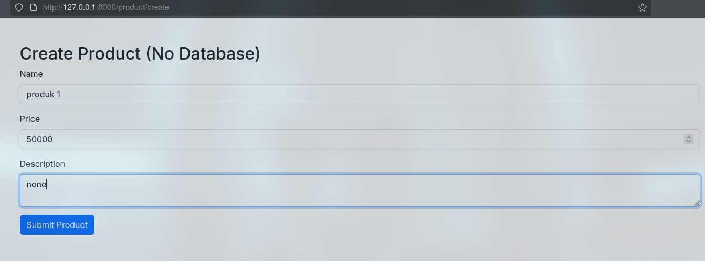

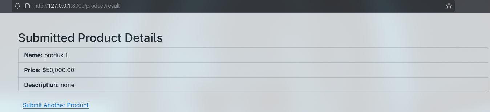

Form berhasil menampilkan hasil input tanpa menggunakan database.


---

## **2.2 Praktikum 2 – Menggunakan Data Transfer Object (DTO)**

### **Langkah-Langkah**

#### a. Membuat Proyek Laravel Baru
```bash
laravel new dto-app
```

#### b. Membuat DTO

```bash
# app/DTO/ProductDTO.php

<?php

namespace App\DTO;

class ProductDTO
{
    public string $name;
    public float $price;
    public string $description;

    public function __construct(string $name, float $price, string $description)
    {
        $this->name = $name;
        $this->price = $price;
        $this->description = $description;
    }

    public static function fromRequest(array $data): self
    {
        return new self(
            $data['name'] ?? '',
            (float)($data['price'] ?? 0),
            $data['description'] ?? ''
        );
    }
}

```

DTO memetakan data dari request menjadi format terstruktur, memastikan integritas dan validitas data.

#### c. Membuat Service Layer

```bash
# app/Services/ProductService.php

<?php

namespace App\Services;

use App\DTO\ProductDTO;

class ProductService
{
    public function display(ProductDTO $product): array
    {
        return [
            'name' => $product->name,
            'price' => $product->price,
            'description' => $product->description,
        ];
    }
}

```

Service menerima DTO dan mengolahnya menjadi bentuk data yang siap ditampilkan.

#### d. Membuat Controller

```bash
# app/Http/Controllers/ProductController.php

<?php

namespace App\Http\Controllers;

use Illuminate\Http\Request;
use App\DTO\ProductDTO;
use App\Services\ProductService;

class ProductController extends Controller
{
    public function create()
    {
        return view('product.create');
    }

    public function result(Request $request)
    {
        $dto = ProductDTO::fromRequest($request->all());
        $service = new ProductService();
        $product = $service->display($dto);

        return view('product.result', compact('product'));
    }
}

```

Controller menerima input form, mengonversinya ke DTO, dan memanggil service untuk menampilkan hasil.

#### e. Menambahkan Route

```bash
# routes/web.php

<?php

use App\Http\Controllers\ProductController;
use Illuminate\Support\Facades\Route;

Route::get('/product/create', [ProductController::class, 'create'])->name('product.create');
Route::post('/product/result', [ProductController::class, 'result'])->name('product.result');

```

Rute menghubungkan tampilan form dan hasilnya.

#### f. Membuat View

- **resources/views/product/create.blade.php**
```bash
<!DOCTYPE html>
<html>
<head>
    <title>Create Product DTO</title>
    <link href="https://cdn.jsdelivr.net/npm/bootstrap@5.3.3/dist/css/bootstrap.min.css" rel="stylesheet">
</head>
<body class="container py-5">
    <div class="row justify-content-center">
        <div class="col-md-6">
            <h2 class="mb-4">Create Product</h2>
            <form method="POST" action="{{ route('product.result') }}">
                @csrf
                <div class="mb-3">
                    <label class="form-label">Name</label>
                    <input name="name" class="form-control" required>
                </div>
                <div class="mb-3">
                    <label class="form-label">Price</label>
                    <input name="price" type="number" step="0.01" class="form-control" required>
                </div>
                <div class="mb-3">
                    <label class="form-label">Description</label>
                    <textarea name="description" class="form-control" rows="3"></textarea>
                </div>
                <button type="submit" class="btn btn-primary">Submit Product</button>
            </form>
        </div>
    </div>
</body>
</html>

```

- **resources/views/product/result.blade.php**
```bash
<!DOCTYPE html>
<html>
<head>
    <title>Product Result</title>
    <link href="https://cdn.jsdelivr.net/npm/bootstrap@5.3.3/dist/css/bootstrap.min.css" rel="stylesheet">
</head>
<body class="container py-5">
    <div class="row justify-content-center">
        <div class="col-md-6">
            <h2 class="mb-4">Product DTO Result</h2>
            <div class="card">
                <div class="card-header">
                    <h5 class="card-title mb-0">Product Details</h5>
                </div>
                <ul class="list-group list-group-flush">
                    <li class="list-group-item">
                        <strong>Name:</strong> {{ $product['name'] }}
                    </li>
                    <li class="list-group-item">
                        <strong>Price:</strong> ${{ number_format($product['price'], 2) }}
                    </li>
                    <li class="list-group-item">
                        <strong>Description:</strong> {{ $product['description'] }}
                    </li>
                </ul>
            </div>
            <a href="{{ route('product.create') }}" class="btn btn-secondary mt-3">Submit Another Product</a>
        </div>
    </div>
</body>
</html>

```


Tampilan menampilkan data dari DTO secara rapi menggunakan Bootstrap.

#### f. Menjalankan Aplikasi

```bash
php artisan serve
```

Aplikasi dijalankan melalui `http://localhost:8000/product/create`.

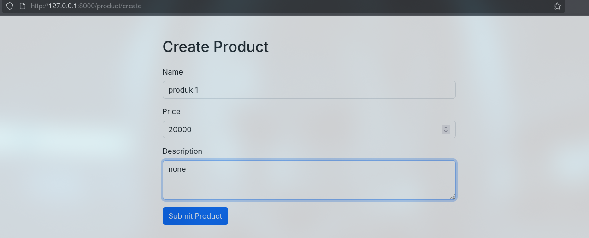
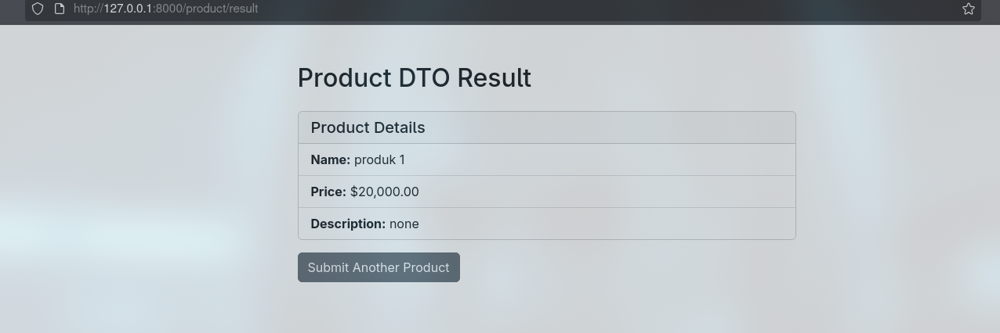


DTO berhasil digunakan untuk mengelola data tanpa bergantung pada database.

---

## **2.3 Praktikum 3 – CRUD Todo App dengan Laravel Eloquent dan MySQL**

### **Tujuan**

Membangun aplikasi web *Todo* sederhana dengan fitur CRUD menggunakan **Eloquent ORM** dan **MySQL**.

### **Langkah-Langkah**

#### a. Membuat Proyek dan Konfigurasi Database

```bash
laravel new todo-app-mysql
composer require doctrine/dbal
php artisan config:clear
```

Buat database baru lali edit file `.env` untuk menyesuaikan koneksi database MySQL.

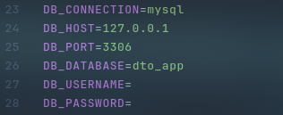


#### b. Membuat Migration

gunakan perintah tersebut untuk membuat migration:
```bash
php artisan make:migration create_todos_table
```

berikut isi migration nya :

```bash
<?php

use Illuminate\Database\Migrations\Migration;
use Illuminate\Database\Schema\Blueprint;
use Illuminate\Support\Facades\Schema;

return new class extends Migration {
    public function up()
    {
        Schema::create('todos', function (Blueprint $table) {
            $table->id();
            $table->string('task');
            $table->boolean('completed')->default(false);
            $table->timestamps();
        });
    }

    public function down()
    {
        Schema::dropIfExists('todos');
    }
};

```

jalankan migrate:
```bash
php artisan migrate
```

Migration digunakan untuk membuat tabel `todos` dengan kolom `task`, `completed`, dan `timestamps`.

#### c. Membuat Seeder

Gunakan perintah di bawah untuk membuat seeder :
```bash
php artisan make:seeder TodoSeeder
```

Berikut isi dari seeder tersebut :
```bash
<?php

namespace Database\Seeders;

use Illuminate\Database\Console\Seeds\WithoutModelEvents;
use Illuminate\Database\Seeder;
use Illuminate\Support\Facades\DB;
use Carbon\Carbon;

class TodoSeeder extends Seeder
{
    public function run()
    {
        DB::table('todos')->insert([
            [
                'task' => 'Belanja bahan makanan',
                'completed' => false,
                'created_at' => Carbon::now(),
                'updated_at' => Carbon::now()
            ],
            [
                'task' => 'Beli buah-buahan',
                'completed' => false,
                'created_at' => Carbon::now(),
                'updated_at' => Carbon::now()
            ],
            [
                'task' => 'Selesaikan proyek Laravel',
                'completed' => true,
                'created_at' => Carbon::now(),
                'updated_at' => Carbon::now()
            ],
        ]);
    }
}

```

Lalu jalankan seeder : 

```bash
php artisan db:seed --class=TodoSeeder
```
Seeder berfungsi mengisi tabel dengan data awal seperti daftar tugas contoh.

#### d. Membuat Model

```bash
php artisan make:model Todo
```

berikut isi file dari model tersebut :
```bash
<?php

namespace App\Models;

use Illuminate\Database\Eloquent\Factories\HasFactory;
use Illuminate\Database\Eloquent\Model;

class Todo extends Model
{
    use HasFactory;

    protected $fillable = ['task', 'completed'];
}

```

Model `Todo` mewakili tabel `todos` dan mengatur kolom mana yang dapat diisi secara massal.

#### e. Membuat Controller CRUD

```bash
php artisan make:controller TodoController
```
Berikut isi dari controller tersebut :
```bash
<?php

namespace App\Http\Controllers;

use Illuminate\Http\Request;
use App\Models\Todo;

class TodoController extends Controller
{
    public function index()
    {
        $todos = Todo::all();
        return view('todos.index', compact('todos'));
    }

    public function create()
    {
        return view('todos.create');
    }

    public function store(Request $request)
    {
        $request->validate(['task' => 'required|string']);
        Todo::create(['task' => $request->task]);
        return redirect()->route('todos.index')->with('success', 'Task added successfully!');
    }

    public function show(Todo $todo)
    {
        return view('todos.show', compact('todo'));
    }

    public function edit(Todo $todo)
    {
        return view('todos.edit', compact('todo'));
    }

    public function update(Request $request, Todo $todo)
    {
        $request->validate(['task' => 'required|string']);
        $todo->update(['task' => $request->task]);
        return redirect()->route('todos.index')->with('success', 'Task updated successfully!');
    }

    public function destroy(Todo $todo)
    {
        $todo->delete();
        return redirect()->route('todos.index')->with('success', 'Task deleted successfully!');
    }
}

```

Controller berisi metode `index`, `create`, `store`, `show`, `edit`, `update`, dan `destroy` untuk seluruh operasi CRUD menggunakan Eloquent.

#### f. Menambahkan Route

```bash
# routes/web.php
<?php

use Illuminate\Support\Facades\Route;
use App\Http\Controllers\TodoController;

Route::get('/', [TodoController::class, 'index'])->name('todos.index');
Route::get('/todos/create', [TodoController::class, 'create'])->name('todos.create');
Route::post('/todos', [TodoController::class, 'store'])->name('todos.store');
Route::get('/todos/{todo}', [TodoController::class, 'show'])->name('todos.show');
Route::get('/todos/{todo}/edit', [TodoController::class, 'edit'])->name('todos.edit');
Route::patch('/todos/{todo}', [TodoController::class, 'update'])->name('todos.update');
Route::delete('/todos/{todo}', [TodoController::class, 'destroy'])->name('todos.destroy');

```

Rute CRUD menghubungkan URL dengan setiap aksi controller.

#### g. Membuat View

- **resources/views/layouts/app.blade.php**
```bash
<!DOCTYPE html>
<html lang="en">
<head>
    <meta charset="UTF-8">
    <meta name="viewport" content="width=device-width, initial-scale=1.0">
    <title>@yield('title', 'Todo App')</title>
    <link href="https://cdn.jsdelivr.net/npm/bootstrap@5.3.3/dist/css/bootstrap.min.css" rel="stylesheet">
</head>
<body class="container mt-4">

    <h1 class="text-center mb-4">Laravel 12 Todo App</h1>

    @if(session('success'))
        <div class="alert alert-success">{{ session('success') }}</div>
    @endif

    <nav class="mb-3">
        <a href="{{ route('todos.index') }}" class="btn btn-primary">Todo List</a>
        <a href="{{ route('todos.create') }}" class="btn btn-success">Add New Task</a>
    </nav>

    @yield('content')

</body>
</html>

```

- **resources/views/todos/index.blade.php**
```bash
@extends('layouts.app')

@section('title', 'Daftar Todo')

@section('content')
    <h2>Daftar Todo</h2>

    <ul class="list-group">
        @foreach($todos as $todo)
            <li class="list-group-item d-flex justify-content-between align-items-center">
                {{ $todo->task }}
                <div>
                    <form action="{{ route('todos.show', $todo->id) }}" method="GET" class="d-inline">
                        <button type="submit" class="btn btn-info btn-sm">Detail</button>
                    </form>
                    <form action="{{ route('todos.edit', $todo->id) }}" method="GET" class="d-inline">
                        <button type="submit" class="btn btn-warning btn-sm">Edit</button>
                    </form>
                    <form action="{{ route('todos.destroy', $todo->id) }}" method="POST" class="d-inline">
                        @csrf
                        @method('DELETE')
                        <button class="btn btn-danger btn-sm">Hapus</button>
                    </form>
                </div>
            </li>
        @endforeach
    </ul>
@endsection

```

- **resources/views/todos/create.blade.php**
```bash
@extends('layouts.app')

@section('title', 'Buat Task Baru')

@section('content')
    <h2>Buat Task Baru</h2>

    <form action="{{ route('todos.store') }}" method="POST" class="mt-3">
        @csrf
        <div class="mb-3">
            <label for="task" class="form-label">Nama Task</label>
            <input type="text" name="task" id="task" class="form-control" required>
        </div>
        <button type="submit" class="btn btn-success">Tambah Task</button>
        <a href="{{ route('todos.index') }}" class="btn btn-secondary">Kembali ke Daftar</a>
    </form>

@endsection

```

- **resources/views/todos/edit.blade.php**
```bash
@extends('layouts.app')
@section('title', 'Edit Task')

@section('content')
    <h2>Edit Task</h2>

    <form action="{{ route('todos.update', $todo->id) }}" method="POST" class="mt-3">
        @csrf
        @method('PATCH')
        <div class="mb-3">
            <label for="task" class="form-label">Nama Task</label>
            <input type="text" name="task" id="task" class="form-control" value="{{ $todo->task }}" required>
        </div>
        <button type="submit" class="btn btn-warning">Update Task</button>
        <a href="{{ route('todos.index') }}" class="btn btn-secondary">Kembali ke Daftar</a>
    </form>

@endsection


```

- **resources/views/todos/show.blade.php**
```bash
@extends('layouts.app')
@section('title', 'Detail Task')
@section('content')
    <h2>Detail Task</h2>

    <div class="card mt-3">
        <div class="card-body">
            <h5 class="card-title">{{ $todo->task }}</h5>
            <p class="card-text">Status: {{ $todo->completed ? 'Selesai' : 'Belum Selesai' }}</p>
            <a href="{{ route('todos.edit', $todo->id) }}" class="btn btn-warning">Edit</a>
            <a href="{{ route('todos.index') }}" class="btn btn-secondary">Kembali ke Daftar</a>
        </div>
    </div>
@endsection

```


Tampilan menampilkan daftar tugas, form tambah, edit, dan detail dengan Bootstrap.

---

#### h. Hasil


#### f. Menjalankan Aplikasi

```bash
php artisan serve
```

Aplikasi dijalankan melalui `http://localhost:8000/`.

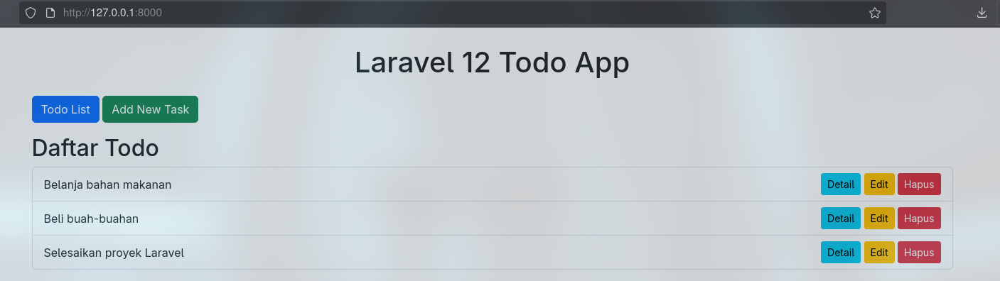

#### berikut uji coba yang dilakukan :

- Membuat Task Baru 

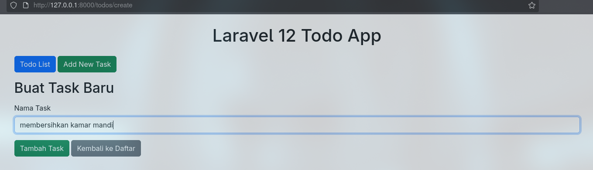

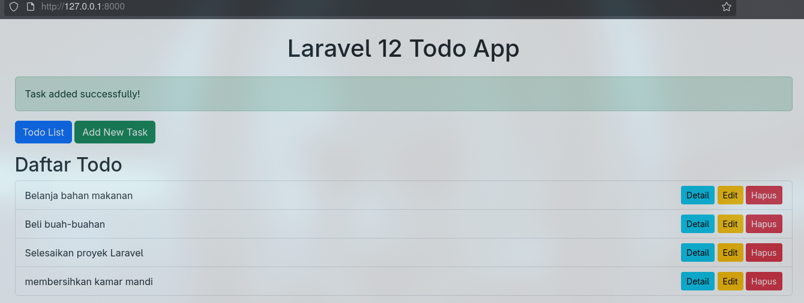

- Melihat detail task

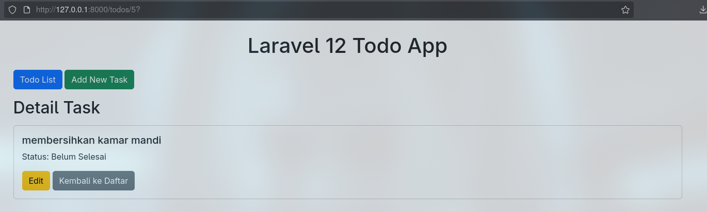

- Edit untuk memperbarui task

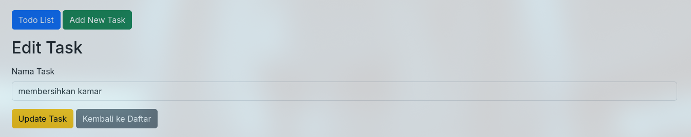

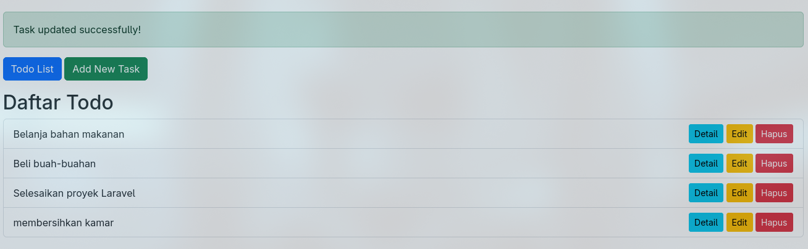

- Menghapus task

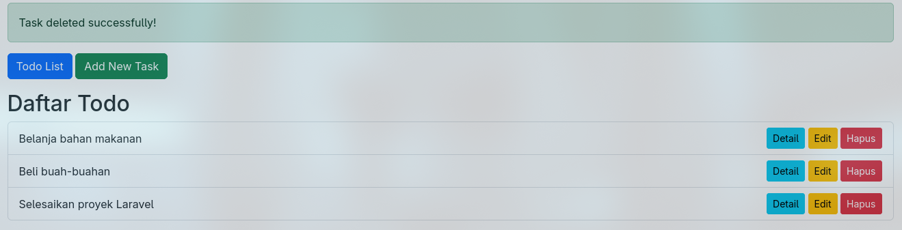

Setelah menjalankan aplikasi:

* Pengguna dapat menambah, melihat, memperbarui, dan menghapus *task* .
* Semua operasi CRUD berhasil dijalankan dengan lancar menggunakan **Eloquent ORM**.

---

# **BAB III – Kesimpulan**

Dari seluruh praktikum yang dilakukan, dapat disimpulkan bahwa **Laravel 12** menyediakan sistem pengelolaan data yang kuat dan fleksibel melalui **Model dan Eloquent ORM**.
Model berperan penting sebagai jembatan antara logika aplikasi dan database, sementara Eloquent memberikan cara berorientasi objek untuk mengelola data secara efisien.

Pendekatan **POCO** dan **DTO** memperkuat prinsip pemisahan logika bisnis dan data, sedangkan **Repository Pattern** memberikan fleksibilitas tinggi terhadap perubahan sumber data.
Dengan dukungan **Migration** dan **Seeder**, Laravel memudahkan proses pengembangan, pengujian, serta pemeliharaan database.
Secara keseluruhan, penggunaan model dan Eloquent ORM menjadikan pengembangan aplikasi lebih cepat, rapi, dan mudah dikembangkan ke tahap lanjutan.

---

## **Daftar Pustaka**

* **Modul 6 – Model dan Laravel Eloquent** — HackMD
  [https://hackmd.io/@mohdrzu/HJWzYp7Reg](https://hackmd.io/@mohdrzu/HJWzYp7Reg)

* **Laravel Official Documentation — Eloquent ORM**
  [https://laravel.com/docs/12.x/eloquent](https://laravel.com/docs/12.x/eloquent)

* **Laravel Official Documentation — Migrations**
  [https://laravel.com/docs/12.x/migrations](https://laravel.com/docs/12.x/migrations)

* **Laravel Official Documentation — Database Seeding**
  [https://laravel.com/docs/12.x/seeding](https://laravel.com/docs/12.x/seeding)


